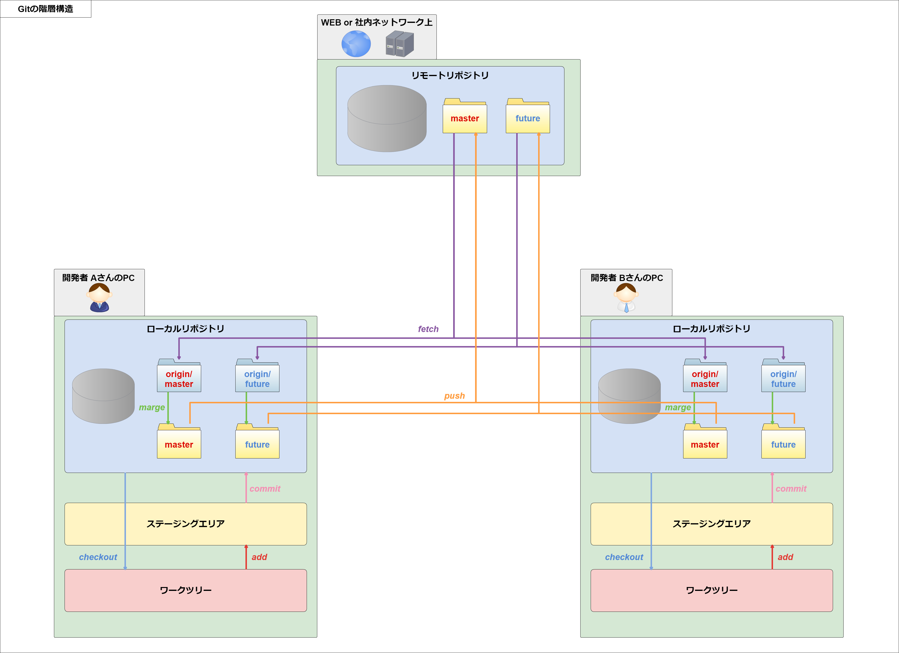
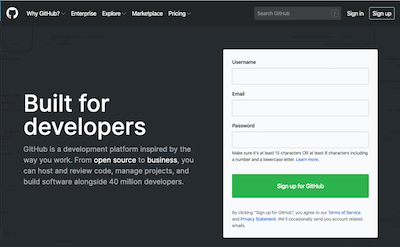
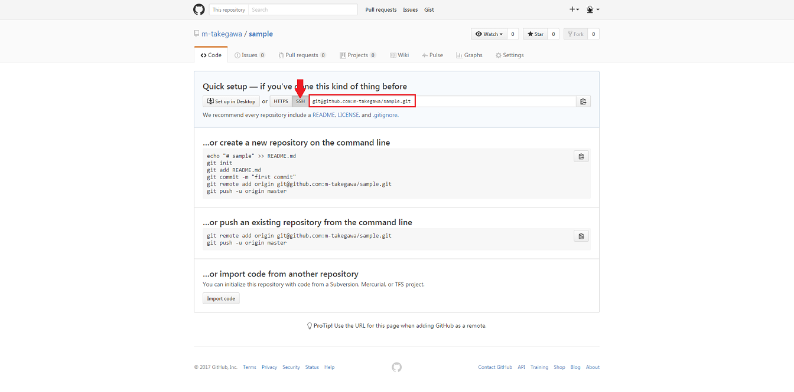
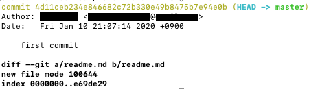
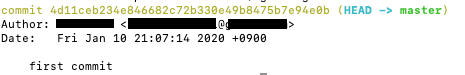

## 3.3 Git基礎1

### 3.3.1 Git

#### Gitとは

    ①　分散型バージョン管理システム  
      「Gitとは何か？」という話になると、必ず出てくるのがこの`分散型バージョン管理システム`という言葉です。  
      この言葉をパッと聞いただけでは、どういうものなのか中々イメージしづらいと思います。  
      なので、今回は`分散型`と`バージョン管理システム`の２つに分けて説明していきましょう。  

    ②　バージョン管理システムについて  
      バージョン管理システムとは、ファイル自体とファイルの変更履歴をセットで管理するシステムです。  
      「いつ」「誰が」「どんな内容で」ファイルを変更したのかを記録していき、複数人で共有することが出来ます。    


    普通のファイル共有等を用いた管理方法と比べると、  

      ・ファイルを変更した後でも、特定の時点まで戻ってやり直す事が出来る
      ・変更した履歴を付けているので、その差分を見ることが出来る
      ・「他の人が変更したファイルを上書きして、他の人の変更内容を消す」等の事故が起きにくい

    といった利点があります。    

    ③　集中型と分散型  
      バージョン管理システムでは、「リポジトリ」というファイルやその変更履歴をまとめておく場所が定義されていて、  
      そのリポジトリの中で管理されているファイルに対して履歴を付けます。  
      見かけ上で言うなら、`リポジトリ = フォルダ(ディレクトリ)`と考えてもいいでしょう。  

      このリポジトリの扱い方によって、バージョン管理システムは２つの方式に分類されます。  

      【集中型】  

        ・リポジトリがリモート(インターネット上のサーバ、社内ネットワーク内のサーバ 等)に一つだけある
        ・ローカル（自分のPC 等）で編集を行い、ファイルの変更はリモートに直接アクセスして行う
          　→ オンライン作業, 変更の履歴を付けるのはリモートだけ

      【分散型】  

        ・リモートの他に、ローカルにもリモートから複製したリポジトリを作成出来る(リポジトリが複数存在する)
        ・毎回の変更はローカルに積み重ねておいて、ある程度まとまった段階でリモートに反映させる
            → オフラインでも作業可, 変更の履歴を付けるのはローカルとリモートの両方(リモートへはローカルから反映)

#### Gitの仕組み

    ①　Gitの階層構造  
      Gitは何段もの階層構造になっていて、それぞれの階層に役割があります。
  

      【リモートリポジトリ】  

        ・共有,管理のベースとなるリポジトリ
        ・ネットワーク上に作成する
        ・全員で共有するファイルを保管しておく場所

      【ローカルリポジトリ】  

        ・リモートリポジトリから複製した、またはローカルで新規に作成したリポジトリ
        ・実際に作業するPC上に作成する
        ・個人で作業するためのファイル、または編集済みのファイル等を保管しておく場所

      【ステージングエリア】  

        ・ローカルリポジトリに登録する前の一時保存場所

      【ワークツリー】  

        ・実際に作業を行うPC上の領域
        ・画面上のフォルダ(ディレクトリ)に表示されているものの状況が反映される


    ② ブランチ  
      Gitには「ブランチ」というものを作成する機能があります。  
      
      実は、最初にリポジトリへ変更履歴を付けた時には、自動で`master`というブランチが作成されるようになっています。  
      自身で作成する際には、このmaster等の既存ブランチから派生させる形で作成していきます。  

      ブランチを作成する時には、  
      `ファイルが格納されているフォルダ(既存ブランチ)を丸ごとコピーして、新しいフォルダ(新規ブランチ)を作成している`  
      というとイメージを掴みやすいかもしれません。  

      ブランチはそれぞれが独立しているので、他の人に影響を与えずに自分の作業を進められるようになります。  

      作成したブランチは、他のブランチに統合することが出来ます。  
      １つのブランチに複数のブランチの内容をまとめることも出来るので、実際に開発では機能毎にブランチを作成して、  
      個々が完成してからmaster等のまとめ役になるブランチに統合すると、よりスムーズに開発することが出来ます。  

      このブランチの運用方法に関しては、後ほどの`GitHub基礎 - GitHub Flowとは`で詳しく解説します。

### 3.3.2 GitHub

#### GitHubとは

    ① 概要  
      - Gitホスティングサイト  
        GitHubは、Gitを使った共有ウェブサービスの事で、主にソフトウェア開発を目的として使用されています。  
        簡潔に述べるならば、Git基礎で解説したリモート(リモートリポジトリを置いておく所)です。  

      - 開発者に嬉しいサポート機能  
        また、単純にリモートの役割を果たすだけでなく、開発者同士のコミュニケーションをとれるSNS機能や、  
        タスク管理にコードレビューの補助が出来るようなものまで、開発を効率的に進めるための機能が備わっています。  
        これらは非常に強力で、サポート機能を活かした`GitHub Flow`というワークフローも考案されています。  
        このワークフローは今回のセミナーでも活用していきますので、後ほど詳しく解説します。

    ② 代表的なサポート機能  
      - Issues  
        `Issues`は、「issue」というものを作成してリポジトリごとに管理する機能です。  
        このissueは直訳すると「問題」になるのですが、ここでは「課題」という意味で捉えると良いと思います。  
        issueは、そのリポジトリの中で議論したいことや対応する課題を書き出します。  
        タグを付けたり、担当者を割り振ったりすることも出来るので、運用によって様々な働きを見せます。  
        作成したissueにはIDが割り振られていて、そのIDでissueへのリンクを貼ることが出来たり、  
        後述するPull RequestsやProjectsでも、issueと紐付いた機能を使用することが出来ます。  

      - Pull Requests  
        `Pull Requests`とは、とても優れたコードレビューの補助機能です。  
        この機能ではPull Request(以降はPR)というものを作成します。  
        このPRは２つのブランチを使用して作成されます。  

        ちなみに、「Pull」とはGitのコマンド`git pull`を意味していて、  
        このコマンドを実行すると、他のブランチの変更内容を自分のブランチに取り入れることが出来ます。  
        その「Request」(要求)をするわけですから、このPRは  
        `「私が変更した内容をレビューして、良ければ取り入れてくださいね」という依頼`のような意味になります。  

        実際にPRを作成・使用する流れは以下のようになります。

          1. ブランチを作成して、その中で作業を進める
          2. リモートに変更を反映させて、GitHub上でPRを作成する
          3. 他の人がPRを基にレビューをする
          4. 修正点があれば修正する
          5. OKならマージ(取り込み)する

        PRの優れている点は、何と言っても`レビューのしやすさ`です。  
        PRを作成した時に、マージして欲しい相手のブランチと自分が作成したブランチの差分が自動で作成されます。  
        レビューをする人はその差分を見ることで、とても効率的かつ簡単にレビューをすることが出来ます。  
        また、差分には１行ごとにコメントを付けることが出来るので、わざわざ別の何かで「○○行目の××」と指定しなくても、  
        そのコメントしたい行で「ここ！」と言えるので、コメントする方も見る方も楽になります。  

          ```
          PRには名前を自由につけることが出来ますが、その先頭に[WIP]という文言がついている場合があります。
          この[WIP]とは"Work In Progress"の略で、PRに使用したブランチが、まだ作業中であることを表しています。
          これは主に、何か相談事があったり、実装に不安があるので一度フィードバックが欲しい等、「取り入れては欲しくないけど、レビューはして欲しい」時に使用されています。
          PRには説明文も付けることが出来るので、困っている内容等を一緒に書き込むことで、相談用のツールとしても活用できるでしょう。
          ```

      - Projects  
        この`Projects`では、「カンバン機能」と呼ばれているものを使用することが出来ます。  
        ざっくり言うと`電子化されたホワイトボード`といったところでしょうか。  

          ```
          アジャイルに関する内容で、バックログと呼ばれるものが出てくるのですが、  
          そこではホワイトボードに付箋を貼って、タスクやストーリーと呼ばれるものを管理しています。  
          近年ではリモートワーク等の普及によりオンラインでの作業が好まれる傾向にあり、  
          直に顔を突き合わせてホワイトボードで作業、というのが難しくなってきています。  

          そこで考えられたのが、この「カンバン機能」、GitHubでは「Projects」という名前で実装されている機能です。  
          ホワイトボード代わりのWEBページに、カードという付箋代わりのものを貼り付けていき、  
          WEB上で現実のホワイトボードと同じ作業を出来るようにしようという機能です。  
          ```

### 3.3.3 Gitの利用

これからの課題・演習では　GitとGitHubを利用したワークフロー`GitHub Flow`を使用して進めていきます。
ここではGitとGithubを利用するための事前準備と基本的なコマンドや利用方法について説明します。

#### Gitのインストール

1. Gitがインストールされているか確認する  
コマンドプロンプトもしくはターミナルで以下のコマンドを入力します。

  ```bash
  $ git --version
  ```

2. Gitをインストールする

1を実行してバージョンが表示されない場合（バージョン1.8未満も含む）は、以下のURLからダウンロード後、Gitをインストールします。
※ バージョンが表示されている場合はこの作業は不要です。

- git  

  https://git-scm.com/downloads

#### 自分のアプリを、コマンドラインでGitHubにPushする

#### Githubのアカウントの作成とGitの初期設定

1. 「GitHub」の公式サイト( https://github.com/ )にアクセスしてアカウントを作成します。  
既にアカウントがある場合はログインしてください。  

- GitHub公式サイト

  https://github.com/

  

2. Gitを利用するための初期設定をする  

  - コマンドプロンプトもしくはターミナルで以下のコマンドを入力します。

    ```bash
    $ git config --global user.name "your-name"
    $ git config --global user.email "your-email"
    ```

    ※ “your-name” , ”your-email” の部分は GitHubで登録したUsernameとEmailを入れてください。  

  - コマンドプロンプトもしくはターミナルで以下のコマンドを入力し、nameとemailの設定が反映されていることを確認してみましょう。

    ```bash
    $ git config --list
    ```

#### Gitの利用と基本のコマンド操作

- リポジトリの作成  

  まずはGitを利用するために、リポジトリを作成しましょう。  
  今回は、GitHub上でリポジトリを作成しておいて、それをローカルにクローン（複製）する形式で行います。  
  GitHub上にリポジトリを作成する手順は以下の通りです。  

    1. 右上の＋メニュー等から、「New repository」を選択する
    2. 「Repository name」の項目に、"fizzbuzz"と入力して「Create repository」ボタンを押す
    3. リポジトリのトップページに遷移する

    作成自体はこれで完了です。  
    次に、実際に作業をする場所を作成していきましょう。  

- ssh-keyの登録<br>
  作成したリポジトリをクローンするには、ssh-keyを発行してGithubに登録する必要があります。
  以下の手順で登録をしてください。

    【ssh-keyの登録】<br>
    まずは、ssh-keyを入れる階層へ移動し、ssh-keyを作成します。
    ```bash
    $ cd ~/.ssh
    $ ssh-keygen -t rsa
    ```
    下記のようにメッセージが出てきますが、それぞれキーの名前（ここではfizzbuzzとする）、キーのパスワードを確認含めて２回入力する。
    ```bash
    Generating public/private rsa key pair.
    Enter file in which to save the key (/Users/(username)/.ssh/id_rsa):
    Enter passphrase (empty for no passphrase):
    Enter same passphrase again:
    ```

    【公開鍵をGithubに登録する】  
      以下の手順で登録をしておくことで、ssh-keyの利用をすることが出来ます。 <br>


    1. 公開鍵の名前をfizzbuzzとした場合、下記コマンドで鍵の内容を表示できます。

        ```bash
        $ cat ~/.ssh/fizzbuzz.pub
        ```

    2. "ssh-rsa"から始まる枠内の文字列をコピーします。
    3. GitHub側の「Settings」メニュー内で「SSH and GPG keys」を選択します。
    4. 「New SSH key」ボタンを押して、「Title」に"FizzBuzz"（目的や用途が分かる名前）、
         「Key」にコピーした文字列をそのまま貼り付けます。
    5. 「Add SSH key」ボタンを押してssh-keyを登録します。<br><br>

    【GitをCloneする】<br>
      ローカルにリポジトリを格納するフォルダ（ワークスペース）を作成しましょう。
      ※既に存在する場合は移動のみ。
    ```bash
    $ mkdir /home/ユーザー名/ruby
    $ cd /home/ユーザー名/ruby
    ```

    作成したリポジトリをローカルにクローンします。
    ユーザー名をXXX、リポジトリ名をfizzbuzzとした場合、下記の入力を行います。
    ```bash
    $ git clone git@github.com:XXX/fizzbuzz.git
    ```
    　クローンが完了したらリポジトリの中に入りましょう。
    ```bash
    $ cd fizzbuzz
    ```  
    リポジトリのURLは、作成したリポジトリのトップページから確認することが出来ます。

      

    今回は、先ほど作成したfizzbuzzリポジトリのURLを使用して、ワークスペースを新規作成しましょう。  

- masterブランチをリモートに作成し、コミットする。

  ワークスペースが作成出来たら、masterブランチをリモートにも作成するために`first commit`をしましょう。  

  1. git commit コマンドを使ってファイルの変更内容をコミットする  

      gitを使用すれば簡単にファイルの進捗を管理することができます。  
      進捗を管理するためにはファイルの変更や追加などを保存しておく必要があります。そのためのコマンドが`git commit`です。
      git commitを利用すればファイルの変更をgitレポジトリに保存することができます。  

      それでは実際にgit commitを使用してみましょう。  
      以下のコマンドを実行し、readme.mdファイルを新規作成してください。  

      ```bash
      $ echo "# fizzbuzz" >> README.md
      ```

      `git add <ファイル名>`のコマンドを実行すると、ステージングエリア（インデックス）に一時保存することができます。
  
      ```bash
      $ git add readme.md
      ```

      そしてgit statusコマンドで確認してみると、以下のようにステージングエリアにファイルが移動されたことがわかります。  

      ```bash
      $ git status
      ```

      ファイルの変更をgitレポジトリに保存するために変更内容をコミットします。  
      `git commit`で変更の履歴を付けます。

      ```bash
      $ git commit -m "first commit"
      ```

      コミットの詳細は `git show`コマンドで確認することができます。

      ```bash
      $ git show
      ```

      

      リポジトリの変更履歴は `git log`コマンドで確認することができます。

      ```bash
      $ git log
      ```

      

      logは今までしたコミットをコミットメッセージの一覧という形で表示します。  
      そのためgit logをした際に一目で何をしたのかわかるようなコミットメッセージを書く必要があります。  

  2. ローカルリポジトリの変更をリモートリポジトリに反映する

      ローカルリポジトリで開発したとしても、それをリモートリポジトリに反映できなければ、他の人が書いているコードは過去のバージョンのコードのままになっています。
      開発コードの状態の矛盾がおきないように、git では`git push`というリモートリポジトリにローカルリポジトリの変更を反映するためのコマンドが用意されています。

      1. ではローカルのmasterブランチで、コミットした変更内容をリモートリポジトリに反映しましょう。
        以下のコマンドを実行してください。

        ```bash
        $ git push origin master
        ```

        上記のコマンドは、`origin`というリモートリポジトリの`master`というブランチにプッシュするという意味になります。

    基本的に開発はこのmasterブランチを基にして、作業内容毎にブランチを切って進めていくことになります。


- git commit コマンドオプション

      `git commit` コマンドは、開発を進めていく際に最も多く使うコマンドのひとつです。  
      そのため、いくつかのオプションを覚えておくことで、効率よく開発を進めていくことができます。

    * 変更したファイルを全てコミットする  
    既にgitに追加済のファイルで、変更があったものを全てコミットするには以下のように入力します。

      ```bash
      $ git add -a
      $ git commit
      ```

      上記と同じことを、「.」を使って１回で行うことができます。

      ```bash
      $ git commit .
      ```

    * 新規ファイルも含め、全てコミットする  
    新規に作成した（gitに追加していない）ファイルも含め、コミットするには以下のように入力します。

      ```bash
      $ git add -A
      $ git commit
      ```

      先程と同様にこちらも「.」を使って行うことができます。

      ```bash
      $ git add .
      $ git commit
      ```

      `git add -a`コマンドと`git add -A`コマンドの挙動が紛らわしいので、新規ファイルを追加する場合は `git add .` で行う方法で覚えておくとよいです。

    * コミットメッセージを指定してコミットする  
    「-m」オプションを指定すると、コミット時にコミットメッセージを指定することができます。

      ```bash
      $ git commit -m "コミットメッセージ"
      ```

    * 間違ったコミットを取り消す  
    間違ってコミットしてしまった場合は`git reset`コマンドを使用します。  
    コミットを取り消す処理は、本当に取り消してよいか、十分注意して行いましょう。

      * コミットだけを取り消す（ローカルのワークディレクトリの内容は変更しない）

        ```bash
        $ git reset --soft
        ```

      * ローカルのワークディレクトリの内容も含め、コミットを取り消す

        ```bash
        $ git reset --hard
        ```

      * 直前の間違ったコミットを取り消す（「HEAD^」は、直前のコミットという意味を表すオプションです）

        ```bash
        $ git reset --soft HEAD^
        ```