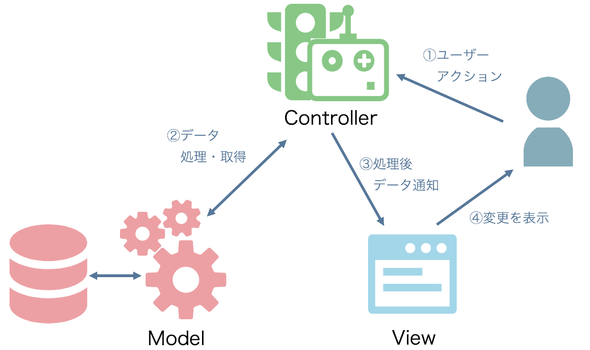

## 4.6 Ruby on Rails：Rails基礎 1

### 4.6.1 Ruby on Railsについて
__【Ruby on Railsとは】__
`Ruby on Rails`とは、Ruby言語製のWebアプリケーションフレームワークです。
とても強力なフレームワークで、WEBアプリを開発する上で便利な機能が多く搭載されています。

2004年に最初のバージョンが公開されてから、その便利さが話題になり多くの人に広がっていきました。
実際、業務としてRubyを扱う場合は、RailsでのWEBアプリ開発がそのほとんどを占めています。
<br>

__【Railsを知る前に知っておきたいこと】__
Railsの学習を進める前に、アーキテクチャや基本理念について解説しておきましょう
<br>

【MVC】
`MVC`とは、WEBアプリのようなUIを持つアプリを実装する際に使用される、デザインパターンの１つです。
ちなみに「MVC」という名前は、"Model","View","Controller"の頭文字を取った略称です。



それぞれの役割は以下のようになります。
- Model
      データの処理を取り扱う部分です。
      データベース（DB）とやり取りをして、データの登録・取得・更新・削除等を行うことが出来ます。
      DB関連だけではなく、ViewやControllerに依存しないデータの処理等はModelに記載しておいて、
      ViewやControllerから呼び出して利用したりもします。

- View
      ユーザの見える範囲を取り扱う部分です。
      主に画面に表示するHTML等を管理する事になります。

- Controller
      クライアントからの個々のリクエストに応じた処理を行います。
      リクエストに応じて、Modelにアクセスしデータの取得・更新を行ったり、
      その結果を描画するViewに引き渡すのが、Controllerの役割です。
 <br>

【DRY】
  `DRY`とは、"Don’t Repeat Yourself"の略称です。
  プログラミングを行う際に心がける理念の１つであり、
  "同じような記述を繰り返してはいけない"といった意味になります。

全く同じコードや似たようなコードがあちこちに散らばっていると、後々メンテナンスをする際に、全て変更するのに時間がかかったり、カバー漏れで不具合が出てしまうことになりかねません。
  そうならないためにも、出来るだけまとめられるものは一箇所にまとめて管理しておこう、という考え方です。
  <br>

【CoC】
`CoC`とは、"Convention over Configuration"の略称です。
意味は"設定より規約"で、従来のフレームワークのように設定を大量に記述するのではなく、
個々の設定に悩むより規約をあらかじめ決めておいて、開発者はロジックを考えることに専念できるようにしよう、というアプリ開発の思想の１つです。

具体的に言えば、Railsでは、あらかじめ名前付けのルールが用意されています。
例えば、次のコマンドを実行すると、ModelはUser(単数形)、DBのテーブル名はusers(複数形)で作成されるルールがあります。

```rb
rails generate model user
```

このような厳格なルールがあるため、命名規則等を熟考をしなくてよくなるだけでなく、
アプリの構造自体がシンプルになったり、他の開発者との意思疎通が容易になったりと、良い面が多くあります。
<br>

Railsにはこれらを補助する機能が備わっています。
活用していけば、とても心強い味方になってくれるでしょう。

### 4.6.2 Cloud9上でRailsアプリケーションを作成

#### 4.6.2.1 作業フォルダの作成
まずは作業場所となるフォルダを作成しましょう。

作業フォルダが出来たら、続いてRailsのインストールに移りましょう。

#### 4.6.2.2 Railsアプリの作成
それでは早速、インストールしたRailsを使用してアプリを作成しましょう。
アプリの作成は以下のコマンドで行います。

        rails new monka-railsbasic

これで"monka-railsbasic"という名前のアプリ（プロジェクト）の雛形が出来上がります。
コマンドを実行すると以下のように、フォルダやファイルが大量に生成されているはずです。

 

こう見ると何だかややこしそうですが、初めからこの全てを理解する必要はありません。
必要な部分や重要な部分は後ほど解説します。

今後の操作はアプリの中で行いたいので、以下のコマンドでディレクトリを移動しておきましょう。

        cd monka-railsbasic

次に以下のコマンドを実行してみてください。

        rails db:create


`rails`はRailsで使えるコマンドで、DB操作やテストの一括実施等が出来ます。
上記のコマンドはDB操作で、一番最初のDBを作成するコマンドです。
まだ中身は空っぽですが、これで一応接続先のDBが作成できました。

実はこの状態で、もう既にアプリとして最低限の機能は使えるようになっています。
試しに以下のコマンドを実行してみてください。

        rails server -b 0.0.0.0 -p 8080

`rails server`がRailsアプリを起動するコマンドで、後の部分はオプションです。
`-b 0.0.0.0`はbindオプションで、IPアドレス等を制御します。
`-p 8080`はportオプションで、アクセスポート番号を指定します。

コンソール内に表示されている、「http://0.0.0.0:8080」 をクリックして、
"open"を選ぶとブラウザで画面が表示されます。

まだデフォルトの画面が表示されるだけですが、きちんと表示されていますね。
ここをベースにアプリを作成していくことになります。

ここで、`rails`コマンドについてもう少し調べてみましょう。
以下のコマンドを実行してみてください。

        rails --help

次の一覧が表示されます。

```rb
  about
  action_mailbox:ingress:exim
  action_mailbox:ingress:postfix
  action_mailbox:ingress:qmail
  action_mailbox:install
  action_mailbox:install:migrations
  action_text:install
  action_text:install:migrations
  active_storage:install
  app:template
  app:update
  assets:clean[keep]
  assets:clobber
  assets:environment
  assets:precompile
  cache_digests:dependencies
  cache_digests:nested_dependencies
  credentials:diff
  credentials:edit
  credentials:show
  db:create
  db:drop
  db:environment:set
  db:fixtures:load
  db:migrate
  db:migrate:down
  db:migrate:redo
  db:migrate:status
  db:migrate:up
  db:prepare
  db:reset
  db:rollback
  db:schema:cache:clear
  db:schema:cache:dump
  db:schema:dump
  db:schema:load
  db:seed
  db:seed:replant
  db:setup
  db:structure:dump
  db:structure:load
  db:system:change
  db:version
  destroy
  dev:cache
  encrypted:edit
  encrypted:show
  initializers
  log:clear
  middleware
  notes
  restart
  routes
  runner
  secret
  secrets:edit
  secrets:setup
  secrets:show
  stats
  test:all
  test:db
  time:zones[country_or_offset]
  tmp:clear
  tmp:create
  version
  webpacker
  webpacker:binstubs
  webpacker:check_binstubs
  webpacker:check_node
  webpacker:check_yarn
  webpacker:clean[keep,age]
  webpacker:clobber
  webpacker:compile
  webpacker:info
  webpacker:install
  webpacker:install:angular
  webpacker:install:coffee
  webpacker:install:elm
  webpacker:install:erb
  webpacker:install:react
  webpacker:install:stimulus
  webpacker:install:svelte
  webpacker:install:typescript
  webpacker:install:vue
  webpacker:verify_install
  webpacker:yarn_install
  yarn:install
  zeitwerk:check
 ```
