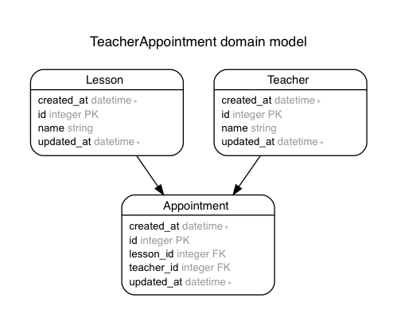

## 6.1 Ruby on Rails：データベース設計、多対多の関連付け

ここからは、ECサイトアプリケーションの開発を例に各実装を解説していきます。
例題で各実装について解説し、問題を解くことによりECサイトが少しずつ完成していきます。  
まず、この章では、ECサイトのデータベース設計の解説を行います。
設計のために、ActiveRecord、データベース設計の基礎、多対多の関連付けについて簡単に説明します。

### 6.1.1 ActiveRecordとは

Active Recordとは、Railsに付属する、重要なライブラリの1つで、MVCのM(モデル)に相当します。
Active Recordは、ORM (オブジェクトリレーショナルマッピング) で実装されています。
ORMとは、簡潔に説明すると、アプリケーションが持つオブジェクトとリレーショナルデータベース(RDBMS)を繋ぐプログラミング技法です。  
また、ActiveRecordでは、下記の仕組みが特に重要となっています。

- モデルとそのデータを表す仕組み
- モデル間の関連性を表す仕組み
- 関連するモデルを通した階層の継承を表す仕組み
- DBに保存する前に検証する仕組み
- オブジェクト指向の手法でDB操作を実行する仕組み

### 6.1.2 データベース設計の基礎

データベース設計はとても大事で難しい部分もあります。それだけで本が1冊書けるぐらいです。ここでは詳しく解説しませんが、データベースの構成次第で、あとの機能の実装がやりにくかったり複雑になってしまうので、くれぐれも注意してください。できるかぎり、サイトで扱うもの、関連のある人、サイトの使われ方などを具体的にイメージしながら考えていきましょう。

データベース設計で決めることは次の4つです。

- 作業1 : アプリで扱うデータをモレなく書き出す  
- 作業2 : データの正規化（グループ分け）をする  
- 作業3 : 各データの型（データの種類）を決める  
- 作業4 : 各データのフィールド名（アルファベット）を決める  

ここにあげたものは、必ずしも順番にする必要はありません。いろいろ考えていくうちに他に必要なデータが見えてきたり、「こっちの名前がこうなら、あっちの名前はこうしよう」 ということが出てきます。
サイトを利用する場面や利用する人のことを想像しながら、納得するまで考えます。可能であれば、他のプログラミング経験者の意見を聞くことをおすすめします。

### 6.1.3 多対多の関連付け

まず、多対多の関連付けとは、お互いのテーブルのレコード同士が複数の相手側レコードと関連付けられる関係の事です。  
Railsで多対多の関連付けをする方法は以下の2通りがあります。

- has_many :throughでの関連付け  
2つのモデルの間に、互いのモデルのIDを保持している中間テーブル(第3のモデル)を作成して、紐付けします。
例えば、次の[3.3-例題]のように、先生と授業の関係を表します。実際にどのように実装するかは例題を見ていきましょう。

- has_and_belongs_to_manyでの関連付け  
has_many :throughではなく、has_and_belongs_to_manyでも多対多の関連付けが可能ですが、
今回は、has_many :throughでの関連付けで実装していきますので詳細な説明は省きます。
has_and_belongs_to_manyはhas_many :throughと仕様が異なっているため、詳しい仕様が気になる人は調べてみましょう。

### 6.1.4 ActiveRecordの代表的なメソッド

ここでは、以下のモデルを例にActiveRecordの代表的なメソッドを簡潔に説明していきます。

`モデル User:ユーザー`

|field名|名称|型|
|:--|:--|:--|
|id|ID|integer|
|name|名前|string|
|mail_address|メールアドレス|string|

`ActiveRecordの代表的なメソッド一覧`  
※表の発行SQLは、わかりやすさのため、テーブル名は省略してカラム名のみ記述しています。

|メソッド|説明|使用例|発行SQL
|:--|:--|:--|:--
|all|全件取得(全カラム)|User.all|SELECT * FROM users
|select|全件取得(カラム指定)|User.select(:name)<br>User.select('name,mail_address')|SELECT name FROM users<br>SELECT name,mail_address FROM users
|find|検索(id指定)|User.find(1)|SELECT * FROM users WHERE id = 1
|find_by|検索(条件指定)|User.find_by(id:1)<br>User.find_by('id > 1')|SELECT \* FROM users WHERE id = 1 LIMIT 1<br>SELECT * FROM users WHERE id > 1 LIMIT 1|
|where|検索(条件指定)|User.where(id:1)<br>User.where('id > 1')|SELECT \* FROM users WHERE id = 1<br>SELECT * FROM users WHERE id > 1
|first|最初のデータをとる|User.first<br>User.first(2)|SELECT \* FROM users ORDER BY id ASC LIMIT 1<br>SELECT \* FROM users ORDER BY id ASC LIMIT 2
|last|最後のデータをとる|User.last<br>User.last(2)|SELECT \* FROM users ORDER BY id DESC LIMIT 1<br>SELECT * FROM users ORDER BY id DESC LIMIT 2
|order|ソート|User.order(:name)<br>User.order(name: :DESC)|SELECT \* FROM users ORDER BY name ASC<br>SELECT \* FROM users ORDER BY name DESC
|limit|制限|User.limit(2)|SELECT * FROM users LIMIT 2

`各メソッドの詳細`

- all
  - レコードを全件取得します
- select
  - カラムを指定し、レコードを取得します。引数の値がカラムとなります。
- find
  - 指定したidのレコードを取得します。引数の値が指定するidとなります。
  - findは、該当するデータが見つからない場合は例外（RecordNotFound）が発生します。
- find_by
  - 特定のカラムの条件を指定し、該当する1件を取得します。引数の値が条件となります。
  - find_byは該当するデータが見つからない場合は、nilを返します。
- where
  - 特定のカラムの条件を指定し、該当する全件を取得します。引数の値が条件となります。
  - whereは、該当するデータが見つからない場合は空の`ActiveRecord::Relation`を返します。
- first
  - レコードの最初の1件を取得します。引数を渡すと最初のn件と指定することもできます。
- last
  - レコードの最後の1件を取得します。引数を渡すと最後のn件と指定することもできます。
- order
  - レコードを引数に指定したカラムで並び変えます。デフォルトの並び順はASC(昇順)になっています。
  - 降順で並び変える場合は`User.order(name: :DESC)`とします。
- limit
  - 特定のレコード件数を取得します。引数の値が最大取得行数となります。

`etc`
- ActiveRecord::Relationについて
  - `ActiveRecord::Relation`とは、モデルオブジェクトのコレクションです。  
  `ActiveRecord::Relation`を返す場合は、メソッドチェーンが可能ですので、  
  例えばwhereに続いてさらにActiveRecordのメソッドを使用する事ができます。  
  ここでは詳細を説明しませんので、気になる場合は調べてみましょう。

- ?の使い方
  - 条件に変数を使用したい場合等に、?(プレースホルダ)を使用します。  
  変数でなくても、直接値を指定することも可能です。(冗長ですが例も記載しています。)

  ``` ruby
  name = "test"
  User.where("name = ?", name)
  #SELECT  "users".* FROM "users" WHERE (name = 'test')

  User.where("name = ?", 'test2')
  #SELECT  "users".* FROM "users" WHERE (name = 'test2')
  ```

### 6.1.5 例題

先生と授業(科目)のテーブルを作成し、先生と授業の多対多で関連付けしていきます。
先生は複数の授業(科目)を担当し、授業(科目)からも複数の先生が受け持っているという多対多の関連付けとして実装します。
データベース構成は以下の通りとします。

Teacher : 先生 テーブル

|field名|名称|型|
|:--|:--|:--|
|name|名前|string|

Lesson : 授業 テーブル

|field名|名称|型|
|:--|:--|:--|
|name|授業名|string|

Appointment : 出席者 テーブル（中間テーブル）

|field名|名称|型|
|:--|:--|:--|
|teacher_id|先生|references|
|lesson_id|授業|references|  



#### ①　アプリケーションの作成

まずは、例題用のRailsアプリケーションを作成します。

```
$ rails new teacher_sample
```

#### ②　Teacherモデルの作成

次に必要なモデルを作成してきます。

```
$ rails generate model Teacher name:string
Running via Spring preloader in process 1718
      invoke  active_record
      create    db/migrate/20170828083314_create_teachers.rb
      create    app/models/teacher.rb
      invoke    test_unit
      create      test/models/teacher_test.rb
      create      test/fixtures/teachers.yml
```

#### ③　Lessonモデルの作成

```
$ rails generate model Lesson name:string
Running via Spring preloader in process 1754
      invoke  active_record
      create    db/migrate/20170828083408_create_lessons.rb
      create    app/models/lesson.rb
      invoke    test_unit
      create      test/models/lesson_test.rb
      create      test/fixtures/lessons.yml
```

#### ③　Appointmentモデルの作成

中間テーブルとなるモデルです。
teacherとlessonを参照するように設定して、モデルを生成します。

```
$ rails generate model appointment teacher:references lesson:references
Running via Spring preloader in process 1786
      invoke  active_record
      create    db/migrate/20170828083440_create_appointments.rb
      create    app/models/appointment.rb
      invoke    test_unit
      create      test/models/appointment_test.rb
      create      test/fixtures/appointment.yml

```

teacher、lessonとappointmentのモデルが作成できたので、テーブルを作成するためにマイグレーションも実行しましょう。

```
$ rails db:migrate
== 20170828083314 CreateTeachers: migrating ===================================
-- create_table(:teachers)
   -> 0.0014s
== 20170828083314 CreateTeachers: migrated (0.0015s) ==========================

== 20170828083408 CreateLessons: migrating ====================================
-- create_table(:lessons)
   -> 0.0011s
== 20170828083408 CreateLessons: migrated (0.0012s) ===========================

== 20170828083440 CreateAppointments: migrating =============================
-- create_table(:appointment)
   -> 0.0036s
== 20170828083440 CreateAppointments: migrated (0.0037s) ====================

```

各モデルの関係を設定するために、以下の内容を追記してください。  
has_many :throughは、appointmentをショートカットして、teacherもしくはlessonを参照できるようにします。

`app/models/teacher.rb`

```
class Teacher < ApplicationRecord
  has_many :appointments
  has_many :lessons,through: :appointments
end
```

`app/models/lesson.rb`

```
class Lesson < ApplicationRecord
  has_many :appointments
  has_many :teachers,through: :appointments
end
```

appointmentモデルはteacherとlessonを参照するように生成したため、既に下記のソースコードとなっています。

`app/models/appointment.rb`

```
class Appointment < ApplicationRecord
  belongs_to :teacher
  belongs_to :lesson
end
```

### 6.1.6 問題

今回のECサイトのデータベース構成は、以下のようにします。  
この構成通りに、モデルを作成してみましょう。BookとTagはscaffold、Taggingはmodelで作成しましょう。
また、各モデルの関係を設定しましょう。本と商品は多対多の関係になることに注意して下さい。

Book : 本 テーブル

|field名|名称|型|
|:--|:--|:--|
|title|タイトル|string|
|author|著者|string|
|published_on|出版日|date|
|showing|商品表示|boolean|
|price|価格|integer|

Tag : 商品タグ テーブル

|field名|名称|型|
|:--|:--|:--|
|name|タグ名|string|

Tagging : タグ付け テーブル

|field名|名称|型|
|:--|:--|:--|
|book_id|本|references|
|tag_id|商品タグ|references|
