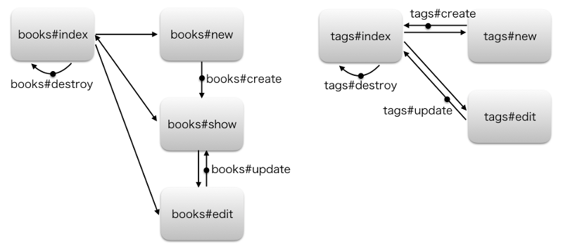

## 7.6 Ruby on Rails：ECサイトの開発 商品一覧1

### 7.6.1 商品一覧の作成

ここからは、要求仕様に従ってECサイトを構築していきます。なるべくRailsらしい機能やデフォルトの設定を使っていきますが、プロジェクトによっていろいろな方法や考え方をするときがあります。これらがすべてではないということを頭の片隅に置いておいてください。

また、gitを利用して適切なバージョン管理を心がけてください。gitにまだ自信がない人はgitコマンドを復習し、まずはコマンドを実行するごと、1つのファイルを変更するごとにコミットする癖をつけましょう。

### 7.6.2 ECサイトの概要とタイムゾーンの設定

#### (a) 解説

本書で構築するECサイトの要求仕様は次のとおりです。一般的なECサイトよりは機能が少なめですが、Railsでアプリを作る際に必要なことはほぼ網羅しています。

 1. 管理画面  
   1.1 商品のCRUDと商品画像のアップロード  
   1.2 管理者のログイン認証  
   1.3 注文状態（全体）の確認  
   1.4 カート状態（全体）の確認  
 2. ユーザー画面  
   2.1 商品一覧と商品詳細ページ  
   2.2 商品の注文  
   2.3 注文完了後のメール送信  
   2.4 商品検索  

もし、アプリをゼロから作ったことがない方は、要求仕様をもらったあとの構築手順も考えてみましょう。自社サービスの開発などでは必ずしもこの順番になりませんが、やることは同じです。本書のはじめに出てきたアジャイル開発の手法も参考にしてみてください。デザインの適応のタイミングは、プロジェクトの都合で後になることもあります。筆者の経験上、早いうちにデザインを当てていく方がアプリを構築している実感がわき、作業をするときのやる気が全然違います。

トップダウンでのアプリ構築手順（参考）

 1. DB設計
 2. 画面遷移の決定
 3. プロジェクト、MVCの作成
 4. デザインの適用
 5. 機能実装（テスト含む）
 6. デプロイ

#### (b) 例題

ここではタイムゾーンの設定を紹介します。機能を実装していく前に必ず行ってください。Railsの時刻のデフォルトはUTCです。このタイムゾーンをきちんと管理しないと、サーバーのタイムゾーンとの整合性が取れなかったり、海外向けサービスを考えている場合は、データ間で時差が生じて大変なことになります。テストを実行する場合にも開発者がハマりやすいポイントですので注意してください。

設定は簡単です。 `config/application.rb` の中に次の1行を追加してください。

    module Monka
      class Application < Rails::Application
        config.time_zone = 'Tokyo' # 追加
      end
    end

ちなみに、日本国内では `Osaka` と `Sapporo` も設定できます。configフォルダ内の設定を変更したので、サーバーを再起動すれば設定完了です。確認方法としては、 `rails console` でTime.zoneを呼び出してみて、意図した時刻オフセットがついていればOKです。

設定前（デフォルト）

    username:~/workspace (master) $ rails c
    Running via Spring preloader in process 37469
    Loading development environment (Rails 5.0.0.1)
    2.3.0 :001 > Time.zone.now
     => Tue, 13 Dec 2016 10:11:37 UTC +00:00

設定後（Tokyoの場合）

    username:~/workspace (master) $ rails c
    Running via Spring preloader in process 37503
    Loading development environment (Rails 5.0.0.1)
    2.3.0 :001 > Time.zone.now
     => Tue, 13 Dec 2016 19:11:59 JST +09:00

#### (c) 問題

ECサイトにタイムゾーンを設定しましょう。

### 7.6.3 画面遷移とルーティングの設定

#### (a) 解説

画面遷移の検討、決定方法についてはUIやプロジェクトの進行にも関連し、本書の目的を超えてしまいますのでここでは割愛します。今回は以下のように、scaffoldをベースにした遷移を作成してください。このとき、各ページのURLはなるべくRailsのデフォルトに沿ったものを使用しましょう。共通の「レール」に乗った方法を使うことで、後々の仕様変更やバージョンアップに強くなり、開発の引き継ぎなどでもスムーズになります。

まず、scaffoldで作成したControllerでは、デフォルトのアクションの遷移は次のとおりになっています。

- 登録：new -> create -> show
- 編集：edit -> update -> show

この遷移はControllerで簡単に変更することができます。操作性やデータ量等を考慮し、場合に応じて設定を変更していきましょう。

また、不要になったアクションなどは、面倒がらずに削除するようにしてください。削除しておかないと、後々メンテナンス性の低下につながります。削除対象として注意するものは次のとおりです。

 - Controllerのアクション
 - Viewのhtmlファイル
 - ルーティング
 - テスト
