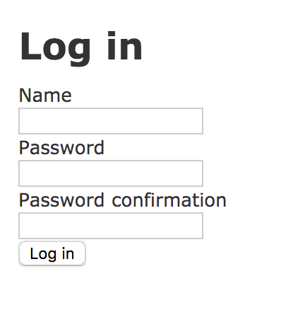
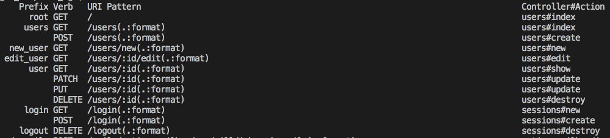
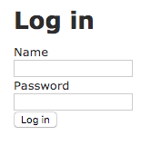

### 8.5 ログイン認証

ログイン機能を提供するgemを使用しないログイン機能を実装します。

#### 8.5.1 ユーザー登録機能作成

**プロジェクトの作成**

```bash
$ rails new login_sample
```

### パスワードはハッシュ化して保存する
パスワードは大切なので、データベースにそのまま保存してはいけません。

なぜなら、パスワードを暗号化していない状態で保存していて、悪意あるアタックでシステムのセキュリティが突破され、データベースの内容が見える形になると、非常にまずいことが想像できます。パスワードを暗号化していると、パスワードの文字が確認できてもそのまま利用することはできません。

そこで、パスワードをランダムな文字列に変換してデータベースに保存する方法としてハッシュ化を行います。

ハッシュ化された文字列から元のパスワードに復元することは一般的にはかなり難しいですが、同じパスワードからハッシュ化すると同じ文字列に変換されます。
ログインで認証をするときは、画面で入力されたパスワードをハッシュ化した文字列と、データベースに保存されているハッシュ化されたパスワードが一致するか確認することで安全に比較ができます。

（参考：https://www.ipa.go.jp/security/vuln/websecurity.html 「IPAの安全なウェブサイトの作り方」）

パスワードをハッシュ化するために、gem `bcrypt`を使用します。<br>
`Gemfile` の `bcrypt` の部分がコメントになっている場合は、#を削除して有効にします。

`Gemfile`

```ruby
# Use Active Model has_secure_password
gem 'bcrypt', '~> 3.1.7'
```

一度 `bundle install` を実行します。

```bash
bundle install
```

**User: ユーザーテーブル**

| field名 | 説明　 | 型 |
|---|---|---|
| id | ID | integer |
| name | 名前 | string |
| password_digest | ハッシュ化したパスワード | string |

ログインするためにはユーザーが必要です。<br>
ユーザーを登録できるよう`scaffold`コマンドで`User`のMVCをを作成しましょう。<br>
`password_digest`属性は、`bcrypt`の`has_secure_password`メソッドで利用されるので、他の名前は指定できません。

下記のコマンドを実行します。

```bash
rails g scaffold User name password_digest
```

下記のコマンドを実行し読み込みテーブルを作成します。

```bash
rails db:migrate
```

`has_secure_password`メソッドが使用可能になりました。<br>
`has_secure_password`はパスワードのハッシュ化だけでなく、`password_digest`に対して以下のようなバリデーションを追加します。
- パスワードの存在性を検証する
- 入力された「パスワード」と「確認入力用パスワード」が等しいかどうかの有効性を検証する
- パスワードが73文字以上の場合のみ許可しない

UserModel内で`has_secure_password`を使用しましょう。

`app/models/user.rb`

```ruby
class User < ApplicationRecord
  has_secure_password
end
```

実際にバリデーションが追加されているのかコンソールを使用して確認してみましょう。

```bash
rails c
```

`User`オブジェクトを作成します。

```bash
user = User.new(name: "test_user")
```

無効な`User`インスタンスを確認してみましょう。<br>

`User`オブジェクトに対して`valid?`メソッドで有効性を検証してみましょう。<br>
`false`が返却されます。これは、`UserModel`のインスタンスである`user`はパスワードを保持していないためです。

```bash
user.valid? # => false
```

有効な`User`インスタンスを確認してみましょう。<br>

`has_secure_password`を使用したことで仮想的に`password`属性と`password_confirmation`属性が作りだされ、`password_digest`属性に保存されます。

```bash
user = User.new(name: "test_user", password: "password", password_confirmation: "password")
user.valid? # => true
```

ハッシュ化されているか確認してみましょう。

```bash
user.password_digest
# => "$2a$12$Ih7SjraevqUwPE.qFbS5DOj/029GAtcXiROaakrDsOec./2QSyLb."
```

パスワードの長さが73文字以上または`password`属性と`password_confirmation`属性の値が異なるパターンも検証してみるとよいでしょう。

`has_secure_password`だけでなく、以下のバリデーションも追加してします。

`app/models/user.rb`

```ruby
class User < ApplicationRecord
  validates :name, presence: true, length: { in: 2..10 }
  validates :password, presence: true, length: { minimum: 6 }
  has_secure_password
end
```

次に画面からユーザー登録を行えるように`app/views/users/_form.html.erb`の内容を以下のように修正します。<br>
「パスワード」と「確認用のパスワード」を入力できるようフォームをフォームを修正しましょう。

`app/views/users/_form.html.erb`

```ruby
<%= form_with(model: user, local: true) do |form| %>
  <% if user.errors.any? %>
    <div id="error_explanation">
      <h2><%= pluralize(user.errors.count, "error") %> prohibited this user from being saved:</h2>

      <ul>
        <% user.errors.full_messages.each do |message| %>
          <li><%= message %></li>
        <% end %>
      </ul>
    </div>
  <% end %>

  <div class="field">
    <%= form.label :name %>
    <%= form.text_field :name %>
  </div>

  <div class="field">
    <%= form.label :password %>
    <%= form.password_field :password %>
  </div>

  <div class="field">
    <%= form.label :password_confirmation %>
    <%= form.password_field :password_confirmation %>
  </div>

  <div class="actions">
    <%= form.submit %>
  </div>
<% end %>
```

次に、`UsersControllerの`StrongParameters`で「パスワード」と「確認用パスワード」を受け取るようにを修正します。<br>

`app/controllers/users_controller.rb`

```ruby
class UsersController < ApplicationController
.
.
.
  private
    # Never trust parameters from the scary internet, only allow the white list through.
    def user_params
      params.require(:user).permit(:name, :password, :password_confirmation)
    end
end
```

これでブラウザからユーザーを登録する準備ができましたので、一度ユーザーを作成します。

コンソールから`rails s`コマンドでサーバーを起動し、ブラウザから`http://localhost:3000/users/new`にアクセスし下記のユーザーを登録しましょう。

```bash
$ rails s
```

`ユーザー情報`

```
name: test_user
password: password
```

ここで作成したユーザーで次のログイン認証を行います。

#### 8.5.2 SessionControllerを作成する

セッション情報を管理する`SessionsController`を作成します。<br>
`Sessions#new`で下の画像のようなログイン画面を表示します。それぞれのフォームから入力された値を`Sessions#create`へ送り、有効なユーザーかどうかを検証し、有効なユーザーであればセッションを作成し「そのユーザーでログインした状態」を作成します。<br>
さらに`Sessions#destroy`でログアウト処理を実装します。



下記のコマンドで`SessionsController`を作成しましょう。<br>
 `Sessions#create` と`Sessions#destroy`は対応する画面(View)はないので、`new`だけを指定します。

```bash
$ rails g controller Sessions new
```

#### 8.5.3 ルーティングを定義する

`SessionsController`で使用するアクションに対してルーティングを定義します。<br>
`routes.rb`を下記の内容に修正しましょう。

`config/routes.rb`

```ruby
Rails.application.routes.draw do
  root 'users#index'
  resources :users
  get    'login'   => 'sessions#new'
  post   'login'   => 'sessions#create'
  delete 'logout'  => 'sessions#destroy'
end
```

コンソールから`rails routes`コマンドでルーティングの定義を確認し画像のように`SessionsController`に対してルーティングが定義されていればOKです。



#### 8.5.4 ログインフォームを作る

ログインフォームを作成します。<br>
`form_with`ヘルパーを使い入力フォームを作成します。通常`form_with`は何も指定しなければHTTPプロトコルは`POST`リクエストになります。<br>
`:url`オプションで指定している`login_path`に`POST`でリクエストが送信されるので `Sessions#create` にアクセスします。
`app/views/sessions/new.html.erb`を下記の内容に修正しましょう。<br>

`app/views/sessions/new.html.erb`

```ruby
<div>
  <%= flash[:notice] %>
</div>

<h1>Log in</h1>

<%= form_with(scope: :sessions, url: login_path) do |f| %>
  <div>
    <%= f.label :name %>
    <%= f.text_field :name %>
  </div>

  <div>
    <%= f.label :password %>
    <%= f.password_field :password %>
  </div>

  <div>
    <%= f.submit "Log in" %>
  </div>
<% end %>
```

サーバーを停止している場合は、コンソールから`rails s`コマンドでサーバーを起動します。

```bash
$ rails s
```

`localhost:3000/login`にアクセスし、下記のような画面が表示されればOKです。




次に作成するログイン認証で、ログインが成功したかどうか明示的にわかりやすいように、ユーザー一覧画面(users#index)を「ログインしていなければ表示されない」ように設定します。<br>
ブラウザがセッション情報を保持していなければログイン画面へリダイレクトするように `users_controller.rb` を修正しましょう。

`app/controllers/users_controller.rb`

```ruby
class UsersController < ApplicationController
  .
  .
  .
  def index
    redirect_to login_path if session[:user_id].nil?
    @users = User.all
  end
  .
  .
  .
end
```

#### 8.5.5 入力されたユーザー情報で認証する

ログイン画面から入力された情報を`Sessions#create`で受け取り、入力されたユーザー情報を元にデータベースから検索します。
ユーザーの存在性が確認され、入力情報の整合性が取れればそのユーザーを認証し、セッションを作成ます。存在しないユーザー情報であればエラーメッセージを表示しログインフォームへリダイレクトするように`Sessions#create`を実装します。

`Sessions#create`を下記のように作成します。<br>
`users`テーブルから`find_by`メソッドを使用し、送信された値「`params[:session][:name]`」で検索します。<br>

ユーザーが見つからなければ変数`user`には`nil`が代入され、もう一度ログインフォームが表示されます。<br>

`authenticate`メソッドは、Modelで`has_secure_passowrd`を宣言すると使用できるメソッドで、入力されたパスワードがデータベースに登録されている`password_digest`属性と一致するか検証します。不一致の場合は、ログインフォームが表示されます。

`session`メソッドはrailsが提供するメソッドで、ハッシュのように扱えます。<br>
`session[:user_id] = user.id`とすることで、ブラウザの一時cookiesに暗号化されたユーザーIDが保存されます。<br>
`session[:user_id]`とすることで暗号化されていないユーザーIDを取り出すことができます。<br>
`session`メソッドで作成されたcookiesは、ブラウザを閉じると有効期限が終了します。

セッションが作成され、ログインが成功すればユーザー一覧画面へ遷移します。

`app/controllers/sessions_controller.rb`

```ruby
class SessionsController < ApplicationController
  def new
  end

  def create
    user = User.find_by(name: params[:sessions][:name])
    if user && user.authenticate(params[:sessions][:password])
      session[:user_id] = user.id
      redirect_to root_path
    else
      flash[:notice] = 'Invalid name/password combination'
      redirect_to login_path
    end
  end

  def destroy
  end
end
```

#### 8.5.6 ログアウトする

このプログラムではブラウザを閉じればセッション情報も削除され、同時にログアウトされた状態になりますが、ここでは、操作による簡単なログアウト機能について説明します。
`Sessions#create` 内で作成したセッション情報を、 `Sessions#destroy` で `session` メソッドを使用しセッション情報を削除してログアウトされた状態にします。

まず `Sessions#destroy` へアクセスするリンクを作成します。<br>
`destroy`アクションには、`DELETE`リクエストでアクセスします。`link_to`ヘルパーの`method:`オプションで`DELETE`リクエストになるよう設定しましょう。

`app/views/users/index.html.erb`

```ruby
.
.
.
<%= link_to 'New User', new_user_path %>
<%= link_to 'Log out', logout_path, method: :delete %>
```

次に`destroy`アクションを実装します。<br>
`destroy`アクション内でセッション情報を削除し、`root_path`へリダイレクトするよう `sessions_controller.rb` に記述します。

`app/controllers/sessions_controller.rb`

```ruby
class SessionsController < ApplicationController
.
.
.
  def destroy
    session.delete(:user_id)
    redirect_to login_path
  end
end
```

セッション情報が削除されるとユーザー一覧画面は表示されなくなり、ログイン画面へ遷移すればログアウト成功です。<br>

以上でgemを使わず簡単ログイン機能を作ることができました。<br>
その他`SessionHelper`を使用したセッション管理やブラウザを閉じてもログイン状態を保持する永続セッションの作成などログイン機能を充実させることが出来るので、調べて実装してみましょう。