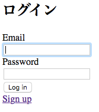

## 9.2 Ruby on Rails：ECサイトの開発 ログイン認証とユーザー管理3

### 9.2.1 例題(つづき)

#### ログイン中のユーザの取得

マイページにはログインしているユーザの名前などの情報を表示することがよくあります。
ここではマイページにログインしているユーザのメールアドレスを表示してみましょう。

Deviseではヘルパーメソッドが利用できます。
ログインしているユーザを取得するには`current_user`というヘルパーメソッドを利用します。

`app/views/mypage/index.html.erb`

```

<h1>マイページ</h1>
<p>マイページ<p>
<p>あなたのメールアドレスは<%= current_user.email %>です</p>
<p><%= linkto 'ログアウト' sessions_path, mehtod: :delete %></p>
```

ログインしてからマイページにアクセスして確認してみましょう。
メールアドレスが表示されています。


#### デザインの変更

今まで見てきたログイン画面や登録画面はDeviseのデフォルト画面です。
Deviseがインストールされているディレクトリにあるファイルなので修正することはできません。

これらのデザインを変更する方法を見ていきましょう。

下記のコマンドでviewファイルを作成します。

```
$ rails generate devise:views
$ ls app/views/devise/
confirmations/  mailer/  passwords/  registrations/  sessions/  shared/  unlocks/
```

各機能で利用しているviewファイルが作成されました。

まずはログイン画面のviewを開いて見ましょう。
ログイン画面のviewは`app/views/devise/sessions/new.html.erb`です

H2タグの部分を英語から日本語に修正してからログイン画面にアクセスしましょう。




今まで英語で表示されていた`Log in`が日本語で`ログイン`と表示されました。

このようにDeviseが提供している画面を修正するには`devise:views`のジェネレータを使ってviewファイルを作成し、そのファイルを修正します。
