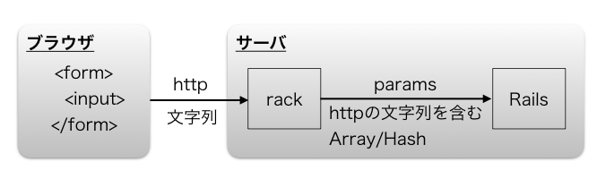

## 9.5 Ruby on Rails：ECサイトの開発 画像アップロード1

### 9.5.1 画像アップロード

前項のデザインテンプレートに商品の写真を載せる部分がありますので、画像アップロード機能を追加しましょう。まず、アプリの管理者が商品の画像データをアップロードします。そのアップロードされた画像データをデザインテンプレートへ表示できるように変更していきます。

ここでは、ブラウザからHTTP(HTTPSも含む)で送られてきたデータが、Railsの内部でどのようにして画像ファイルとして扱われるかを少し説明します。そのあと、画像アップロードの機能は便利なgemがありますので、そちらを利用して簡単に実装してしまいましょう。

- - -

### 9.5.2 Railsにおける画像アップロードの概要

#### (a) 解説

##### ブラウザ 〜 サーバ

ブラウザは、htmlのformタグとinputタグを組み合わせて利用することで、様々な文字情報をサーバーに送ることができます。画像ファイルも同じです。inputタグのtypeをfileにすると、ファイルを選択できるようになります。そこで選択されたファイルは、バイナリデータとしてサーバーへ送られます。このとき、データはHTTPのプロトコルに乗っ取った表現になっていますが、あくまでそれらは大きな文字列のかたまりです。例えば、htmlとして `"2017-12-31"` という部分があったとしても、 それをRubyとして判断するとStringであることに気をつけてください。

##### サーバ 〜 Railsのコントローラ

サーバーに到着したHTTPのデータは、Railsアプリへ直接渡されるのではなく、rackというミドルウェアを経由します。Railsアプリはrackに依存しており、rackはどこでも必ず必要です。rackの役割はいろいろありますが、HTTPデータについては、HTTPの文字列のかたまりを、要素別にRubyのArrayまたはHashに整形してくれます。これが、コントローラで扱うparamsの元ネタです。
rackでArrayやHashに整形されたあとは、ActionDispatch::Request::Utilsでさらに分析され、ファイルの場合はActionDispatch::Http::UploadedFileでファイル名やファイルのバイナリ、ファイルサイズなどを取り出しやすいようにfileオブジェクトへ格納します。
そうして、HTTPからのデータをコントローラで受け取るときには、paramsという扱いやすい形式になっています。画像データも同様に、fileオブジェクトに格納されたものから保存したいものを取り出し、同様に `.save` すれば、ファイルアップロードの機能を実現することができます。



### 9.5.3 Active Storageを利用した画像アップロード(Rails5.2から)

Active StorageはRails 5.2から利用できるgemです。

#### Active Storage

 1. Active Storageを導入するために新規プロジェクトを作成します
    ```bash
    $ rails new storage
    ```
 2. マイグレーションファイルを作成します
    ```bash
    $ cd storage
    $ rails active_storage:install
    ```
    - `active_storage_blobs` テーブルと `active_storage_attachments` テーブルのマイグレーションファイルが作成されます

 3. マイグレーションファイルの内容をデータベースに反映する
    ```bash
    $ rails db:migrate
    ```

 4. 雛形を作成します

    Userモデルにnameカラムを設定
    ```bash
    $ rails generate scaffold user name:string
    ```

 5. Userモデルをデータベースに反映します
    ```bash
    $ rails db:migrate
    ```

 6. テーブル同士の関連付けを行います

 - app/models/user.rb

    ```ruby
    class User < ApplicationRecord
      has_one_attached :photo
    end
    ```
 7. Strong Parameterを設定します

 - app/controllers/users_controller.rb

    ```ruby
    def user_params
      params.require(:user).permit(:name, :photo)
    end
    ```
 8. viewファイルに画像をアップロードする項目を追加します

 - app/views/users/_form.html.erb

    ```html
    <%= form_with(model: user, local: true) do |form| %>
      (省略)
      <div class="field">
        <%= form.label :name %>
        <%= form.text_field :name %>
      </div>

      <div class="field">
        <%= form.file_field :photo %>
      </div>

      <div class="actions">
         <%= form.submit %>
      </div>
      (省略)
    <% end %>
    ```

 9. ユーザーの詳細画面にアップロードした画像を表示するよう設定します

 - app/views/users/show.html.erb

    ```html
   (省略)
    <p>
      <strong>Name:</strong>
      <%= @user.name %>
    </p>

    <p>
      <strong>Photo:</strong>
      <% if @user.photo.attached? %>
        <%= image_tag @user.photo %>
      <% end %>
    </p>

   (省略)
    ```

    ※実際に画像をアップロードして確認してみましょう。

    
