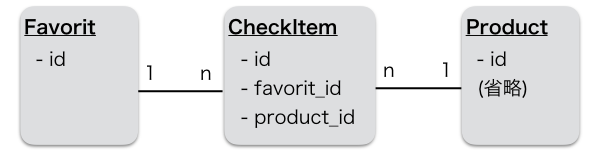

## 12.2 Ruby on Rails：ECサイトの開発 セッションと複数商品の注文2

### 12.2.1 セッションを利用したカート機能の実装

#### (a) 解説

セッションの利用例として「お気に入り登録」機能を実装し、商品名の横にお気に入りマークを表示するようにしましょう。
ユーザーが「お気に入り」ボタンをクリックしたら商品情報を取得し、セッションIDとともにDBへ保存します。このとき、トップページには、DBに保存された詳細ページの一覧を表示するだけです。

#### (b) 例題

##### b-1) セッション管理テーブルの準備

まず、セッション用のテーブルを追加していきましょう。
セッションID（クッキーに保存する値）を管理するテーブルとしてFavoriteテーブルと、チェックした商品明細を管理するCheckItemテーブルを準備します。その後、モデルのリレーション設定、セッション登録・管理を行うメソッドを追加、チェックした商品が閲覧できる画面を作成していきます。

FavoriteモデルとCheckItemモデルの関係性は下の図のようになります。



- - -

###### Favoriteテーブルの追加

セッションIDを管理するためだけのテーブルですので、id (integer) のみを用意します。

```
$ rails generate scaffold Favorite
```

_ _ _

###### CheckItemテーブルの追加

CheckItemテーブルは中間テーブルの位置づけですので、FavoriteテーブルとProductテーブルのidをreferencesにしておきましょう。

```
$ rails generate scaffold CheckItem product:references favorite:references
```

Favoriteテーブル・CheckItemテーブルの作成をデータベースに反映しましょう。

```
$ rails db:migrate
```

_ _ _

###### モデルの関連付け

Favorite、CheckItem、Productモデルの関連付けを行い、Favorite削除時は同時にCheckItemの削除を行えるようにしておきましょう。

`app/models/favorite.rb`
```
class Favorite < ApplicationRecord
  has_many :check_items, dependent: :destroy
end
```

`dependent: :destroy`オプションを追加することで、favoriteレコードをdestroyメソッドで削除したとき、そのfavoriteに紐づいていたcheck_itemをRailsが全て削除してくれます。

`app/models/product.rb`
```
class Product < ApplicationRecord
  has_many :check_items
end
```

`app/models/check_item.rb`
```
class CheckItem < ApplicationRecord
  belongs_to :product
  belongs_to :favorite
end
```

##### b-2) セッション登録機能の追加

現在のFavorite（お気に入り）を取得する処理をcurrent_favoriteメソッドに実装します。処理の流れは以下のとおりです。共通コントローラであるApplicationControllerに作成しましょう。

 1. セッションから取得したfavorite_idを元にFavoriteテーブルからお気に入り情報を取得（存在しない場合、Favorite作成）
 2. 取得したFavorite情報よりIDを取得し、セッションに設定
 3. Favorite情報を返却

`app/controller/application_controller.rb`
```
class ApplicationController < ActionController::Base

  (省略)

private

  def current_favorite
    favorite = Favorite.find_or_create_by(id: session[:favorite_id])
    session[:favorite_id] = favorite.id
    favorite
  end
end
```

- - -

###### Favoriteに入れる機能

FavoriteモデルにCheckItemを登録するadd_productを実装しましょう。  
商品が既にあれば取得、なければ新規でCheckItemオブジェクトを生成し、CheckItemオブジェクトを返してください。

`app/models/favorite.rb`
```
class Favorite < ApplicationRecord
  has_many :check_items, dependent: :destroy

  def add_product(product_id)
    check_items.find_or_initialize_by(product_id: product_id)
  end
end
```

セッションからFavorite情報を取得し、check_itemsコントローラにお気に入りの商品を登録できるようにcreateメソッドを実装しましょう。  
FavoriteとProductを取得し、CheckItemを追加してトップ画面へ遷移させてください。

`app/controllers/check_items_controller.rb`
```
class CheckItemsController < ApplicationController
  (省略)

  # POST /check_items
  # POST /check_items.json
  def create
    favorite = current_favorite
    product  = Product.find(params[:product_id])
    @check_item = favorite.add_product(product.id)

    respond_to do |format|
      if @check_item.save
        format.html { redirect_to root }
        format.json { render :show, status: :created, location: @check_item }
      else
        format.html { redirect_to products_index_url,
                      notice: 'Unprocessable entity.' }
        format.json { render json: @check_item.errors,
                      status: :unprocessable_entity }
      end
    end
  end

  (省略)
end
```

最後にトップ画面へ「お気に入り」ボタンとお気に入り表示を設置しましょう。お気に入りに入っているかどうかの判定は、ヘルパーメソッドとして実装します。

`app/helpers/products_helper.rb`
変更後
```
module ProductsHelper
  def current_favorite?(product, favorite)
    favorite.check_items.map{|i| i.product_id}.include?(product.id)
  end
end
```


`app/controllers/products_controller.rb`
変更後
```
def index
  （省略）
  @favorite = current_favorite #追加
end
```


`app/views/products/index.html.erb`
変更後
```
  (省略)

<div class="row marketing">
  <h2>BOOK</h2>
  <div class="col-lg-12">
    <% @books.each do |book| %>
      <h3><%= book.title %></h3>
      <p><%= book.author %></p>
      <p><%= book.published_on %></p>
      <p>
        <%= number_to_currency(book.try(:price), precision: 0, unit: "円") %>
        <% if current_favorite?(book, @favorite) %>
            <%= '☆' %>
        <% else %>
          <%= link_to 'お気に入り', check_items_path(product_id: book.id),
              method: :post, class: 'btn btn-default' %>
        <% end %>
        <%= link_to '購入', new_order_path(product_id: book.id),
            class: 'btn btn-default' %>
      </p>
    <% end %>
  </div>
</div>
```

#### (c) 問題

では、実際にカート(買い物かご)の機能を実装していきます。セッションIDを管理するテーブルとしてCartテーブルとカート内の商品明細を管理するLineItemテーブルを用意しましょう。
次章でユーザーがカートを利用して複数商品を一括購入できるように実装します。

CartモデルとLineItemモデルの関係性は下の図のようになります。LineItemテーブルのquantityは、購入個数（integer）を表します。


実装方法がイメージできない場合は、以下のステップを参考に実装してみてください。

##### ステップ c-1) セッション管理テーブルの準備
- Cartテーブルの追加
- LineItemテーブルの追加（個数については、初期値を設定）
- 追加したモデルの関連付けを設定

##### ステップ c-2) セッション登録機能の追加
- ApplicationControllerにcurrent_cartを実装

##### ステップ c-3) カート登録機能の追加
- Cartモデルに商品を登録するadd_productを実装
- LineItemsコントローラのcreateメソッドで、セッションからカート情報を取得し、Cart#add_productを利用してカートに注文明細を登録
- 商品詳細画面の「購入する」ボタンを「買い物かごに入れる」ボタンにしてリクエストをline_items#createに変更

##### ステップ c-4) カート（買い物かご）一覧画面の編集
- LineItemモデルにbookごとの小計金額を表示するためのtotal_priceを実装
- Cartモデルにカート合計金額を表示するためのtotal_price、合計個数を表示するためのtotal_numberを実装
- LineItem#total_price, Cart#total_price,total_numberを利用してカート一覧画面（carts#show）を編集

##### ステップ c-5) カート削除機能の追加
- Cartsコントローラにセッションを削除できるようにdestroyメソッドを実装
- カート一覧画面に「買い物かごを空にする」ボタンを追加
