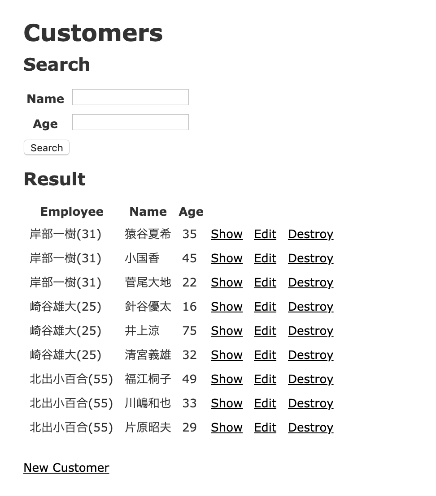

## 12.6 Ruby on Rails：gemを使わない検索1

### 12.6.1 検索フォームの作成

ここでは商品一覧や注文一覧からタイトルや著者、購入者、状態から検索が行える機能を追加します。
Webアプリケーション開発では、検索機能を実装することが多くあります。以降の章で検索機能を簡単に実装できる`ransack`というgemを使って実装していきますが、まずは`ransack`を使わない検索を作ってみます。

検索条件は画面から入力します。下記のような顧客の検索画面を実装します。

プロジェクトの作成

```
$ rails new search_sample
```



#### scaffoldを使った一覧画面の作成

モデルは下記の2つを準備します。
以降の章で検索のgem`ransack`を使用して検索画面を実装しますが、モデルとデータは同じものを使用します。

##### 社員 (Employee)
|項目名|カラム名|型|
|---|---|---|
|名前|name|string|
|年齢|age|integer|

##### 顧客 (Customer)
|項目名|カラム名|型|
|---|---|---|
|担当者|employee_id|integer|
|名前|name|string|
|年齢|age|integer|

Scaffoldを使って一覧画面を準備しましょう

`$ rails g scaffold employee name age:integer`

`$ rails g scaffold customer employee:references name age:integer`

generatorで生成されたコードはその時点で一度コミットする癖を付けましょう。

migrateします。

`$ rails db:migrate`

リレーションの設定を行います。

`app/models/employee.rb`

```
class Employee < ApplicationRecord
  has_many :customers # 追加
end
```

次にサンプルデータを登録します。

db/seeds.rbに下記コードを追記しましょう

`db/seeds.rb`

```
employee1 = Employee.create(name: '岸部一樹', age: 31)
employee2 = Employee.create(name: '崎谷雄大', age: 25)
employee3 = Employee.create(name: '北出小百合', age: 55)

employee1.customers.create(name: '猿谷夏希', age: 35)
employee1.customers.create(name: '小国香', age: 45)
employee1.customers.create(name: '菅尾大地', age: 22)
employee2.customers.create(name: '針谷優太', age: 16)
employee2.customers.create(name: '井上涼', age: 75)
employee2.customers.create(name: '清宮義雄', age: 32)
employee3.customers.create(name: '福江桐子', age: 49)
employee3.customers.create(name: '川嶋和也', age: 33)
employee3.customers.create(name: '片原昭夫', age: 29)
```

サンプルデータを登録します。

`rails db:seed`

`app/models/customer.rb`はscaffoldでreferencesを指定したので自動生成されています。

#### 検索フォームの作成
ここでは、顧客の検索をつくるので`app/views/customers/index.html.erb`に検索フォームを追加します。(1)

また、検索結果をわかりやすくるために、担当者（Employee）の名前と年齢が表示されるようにしましょう。(2)

`app/views/customers/index.html.erb`

```
<p id="notice"><%= notice %></p>

<h1>Customers</h1>

<% # (1)検索フォーム ここから %>
<h2>Search</h2>
<%= form_with url: '/customers', local: true, method: :get do |f| %>
  <table>
    <tr>
      <th>Name</th>
      <td><%= f.text_field :name, value: params[:name] %></td>
    </tr>
    <tr>
      <th>Age</th>
      <td><%= f.number_field :age, value: params[:age] %></td>
    </tr>
  </table>
  <%= f.submit 'Search' %>
<% end %>
<h2>Result</h2>
<% # (1)検索フォーム ここまで追加 %>
<table>
  <thead>
    <tr>
      <th>Employee</th>
      <th>Name</th>
      <th>Age</th>
      <th colspan="3"></th>
    </tr>
  </thead>

  <tbody>
    <% @customers.each do |customer| %>
      <tr>
        <% # 修正(2) 担当者の名前に(年齢)を追加 %>
        <td><%= customer.employee.name %>(<%= customer.employee.age %>)</td>
        <td><%= customer.name %></td>
        <td><%= customer.age %></td>
        <td><%= link_to 'Show', customer %></td>
        <td><%= link_to 'Edit', edit_customer_path(customer) %></td>
        <td><%= link_to 'Destroy', customer, method: :delete, data: { confirm: 'Are you sure?' } %></td>
      </tr>
    <% end %>
  </tbody>
</table>

<br>

<%= link_to 'New Customer', new_customer_path %>

```

ここでは、検索フォームは`form_with`を使用して作成します。

入力欄は`text_field`と`number_field`を利用します。
これらのメソッドに渡す第一引数には、画面の項目名、第二引数には初期値(最初に表示したい値)を設定します。
