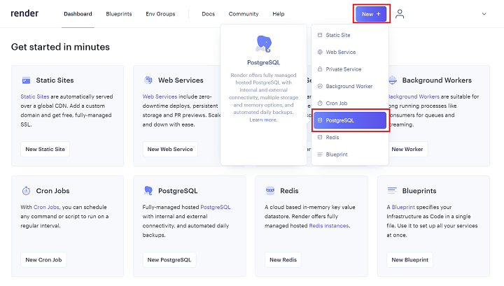
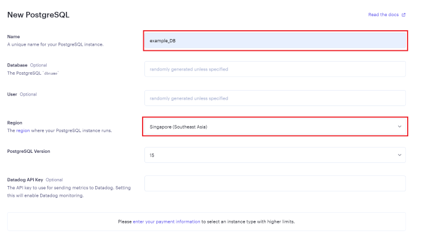

## 14.2 Ruby on Rails：ECサイトの開発 Renderへのデプロイ1

###	14.2.1 Renderについて

アプリケーションを公開するには、サーバーにプログラムファイルを配置し、それにセキュリティなどを考慮して動く状態にする必要があります。これらの作業をデプロイといいます。  
今までのデプロイは、サーバー用のPCを用意し、OSや使用する言語をインストールし、セキュリティーなどの設定を追加し、そのうえでプログラムファイルを設置して動作確認をするという、とても手間がかかるものでした。  
しかし、近年のクラウドサービスの進歩は目覚ましいものがあり、ブラウザから管理画面にログインして表示されるボタンをいくつかクリックしたり、コマンドを数行実行したりするだけでデプロイができてしまうというものが主流になりつつあります。  
その中でRenderは、PaaS（Platform as a Service）と呼ばれるクラウドサービスです。  
Renderでは、DBが1つまで90日間までが無料枠として運用することができます。(DBを止めたり作り直したりすることで新たにDBを運用できます。)

### 14.2.2 Renderへのリリース準備

Renderのアカウントを持っていない人は、下記のURLのサイトにあるSign upからアカウントを作成してください。アカウントの作成は無料です。今回のアプリケーションのレベルでは課金されることはありませんのでご安心ください。また、ログインIDとパスワードはデプロイのときに必要ですのですぐわかるようにしておいてください。GitHubからの連携を行うとスムーズにリリースを行えますので、GitHubアカウントを作成済みの場合はそちらからサインインすると便利です。  
<https://dashboard.render.com/>  


では、Renderへのリリースの準備をしましょう。今回は以下の順序で行います。

1. アプリ内のデータベースの設定
2. Renderのデータベースの作成  
3. Renderの本番環境の作成と設定  
4. アプリとデータベースの接続

### 14.2.2.1 アプリ内のデータベースの設定
まずはアプリ内のGemfileとデータベースの設定を変更します。Renderでは、デフォルトのデータベースはPostgreSQLです。
PostgreSQLを使用するためのgemを追加します。

`Gemfile`
``` ruby
    ruby '2.7.7'
         ・
         ・
    # Use sqlite3 as the database for Active Record
    # gem 'sqlite3', '~> 1.4' #コメントアウト
         ・
         ・
    group :development, :test do
      gem 'sqlite3', '~> 1.4' # 追加
      # Call 'byebug' anywhere in the code to stop execution and get a debugger console
      gem 'byebug', platforms: [:mri, :mingw, :x64_mingw]
    end
         ・
         ・
    group :production do # 追加
      gem 'pg', '~> 1.4' # 追加
    end # 追加
```

developmentモードとtestモードではこのままSQLiteを利用しますので、元から存在する`gem 'sqlite3'`はコメントアウトし`group :development, :test do`内へ移動させます。  
`group :production`はデフォルトで書かれていないので追加します。  
Gemfileに追加出来たら以下のコマンドを実行します。
```ターミナル
bundle install --without production
bundle lock --add-platform x86_64-linux
```

`config/database.yml` を開いて、production環境のデータベース指定を変更してください。

``` ruby
production:
  <<: *default
  database: db/production.sqlite3 #削除
  adapter: postgresql # 追加
  encoding: unicode # 追加
  pool: 5 # 追加
```

### 14.2.2.2 Renderのデータベースの作成
[Render](https://dashboard.render.com/)のダッシュボードにデータベースを追加していきます。
New+のボタンをクリックしPostgreSQLを選択しましょう。
  

画面が変わり次のようなページに遷移します。  
  
NameとRegionを変更していきます。  
Nameは「対象のアプリ名_DB」にするとわかりやすいです。Regionは`Singapore`を選択しましょう。

今回は無料枠を利用しますので、Instance Typeは`Free`にします。  
`Create Database`をクリックしてデータベースを作成します。  
作成が完了するまで少し時間がかかります。  

Dashboardに先ほど作成したデータベースが追加され、STATUSがAvailableになっていればデータベースの作成は完了です。  
先ほど作成したアプリはGitHubにpushし、次の準備をしておきましょう。
次は、Renderの本番環境の作成と設定を行っていきます。
