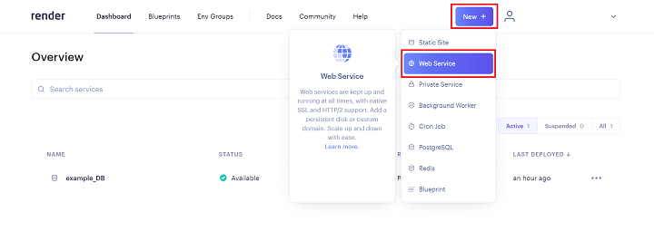
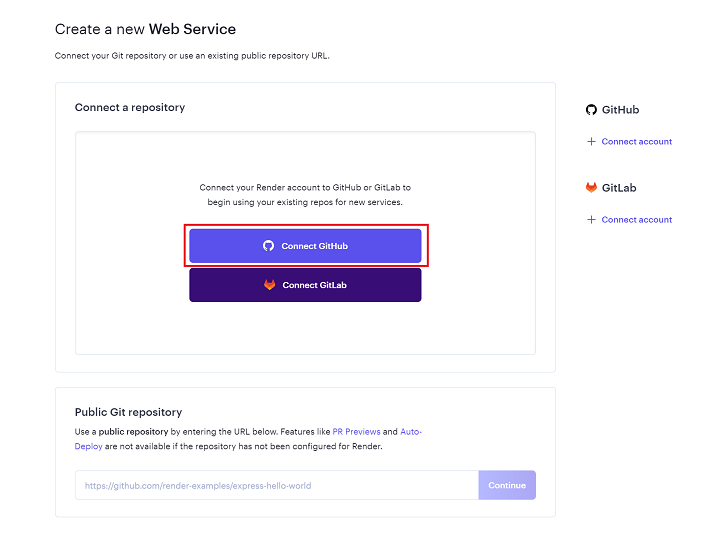
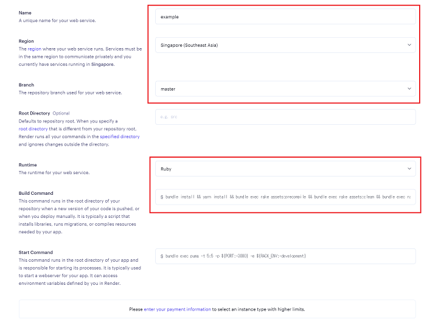
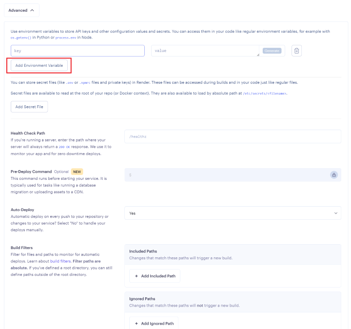
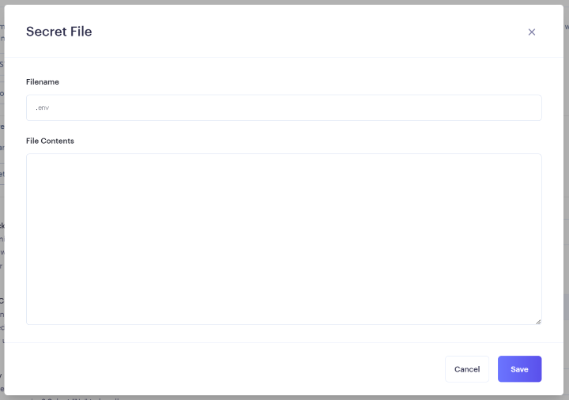
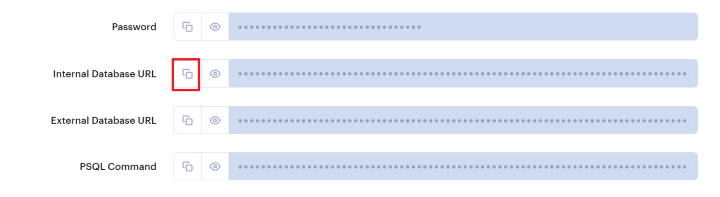
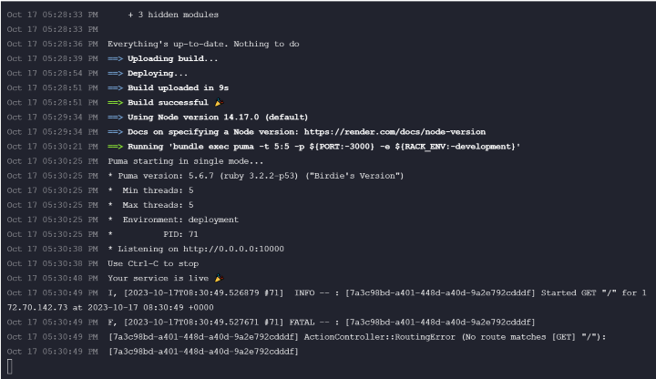
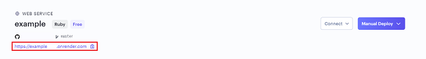
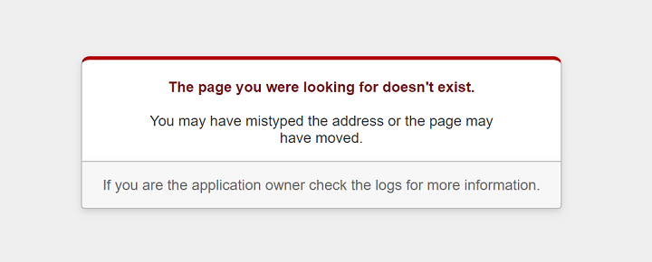

## 14.3 Ruby on Rails：ECサイトの開発 Renderへのデプロイ2

### 14.3.1.1 Renderの本番環境の作成と設定
ここからはRender側で本番環境の設定をしていきます。
データベースを作成したときのように`New+`ボタンを押しましょう。  
今度は`Web Service`を選択します。  
 

"How would you like to deploy your web service?"と書かれた画面に遷移したらそのまま`Next`をクリックします。  

publicのリポジトリを使用する場合はPublic Git repositoryに対象のリポジトリのURLを入力することで使用できます。  
また、privateの場合はGitHubと連携することで使用可能になります。
今回はGit Hub連携させてみますので、`Connect GitHub`から連携してみましょう。  
 

連携が完了するとGitHubにあるリポジトリをConnect a repositoryから選択できるようになります。
デプロイしたいリポジトリの横にある`Connect`をクリックしてみましょう。なければGitHubからリポジトリを作成しましょう。

アプリ作成画面では以下の項目の設定をします。
| 項目          | 設定           | 
| ------------- | -------------- | 
| Name          | 対象のアプリ名 | 
| Region        | Singapore      | 
| Branch        | master         |
| Runtime       | Ruby           | 
| Build Command | 下記参照       | 

 

Nameはわかりやすい名前を設定しましょう。GitHubのリポジトリ名などに合わせるとわかりやすいと思います。  
Regionは先ほど作成したDBに合わせます。

Build Commandはデプロイするときにどのような設定でアプリを起動するかを決めるコマンドです。

``` ruby
bundle install && yarn install && bundle exec rake assets:precompile && bundle exec rake assets:clean && bundle exec rails webpacker:compile && bundle exec rake db:migrate
```

seedデータをデプロイ時に`db:seed`することもできます。もし、seedデータを登録する場合には二重にデータが登録されるなど様々な不具合に繋がることもありますので、コードをしっかりと確認してから登録するようにしましょう。
``` ruby
bundle install && yarn install && bundle exec rake assets:precompile && bundle exec rake assets:clean && bundle exec rails webpacker:compile && bundle exec rake db:migrate && bundle exec rails db:seed
```

**Advancedの設定**  
次はAdvancedの設定をします。
Create Web Serviceボタンの上にあるAdvancedボタンをクリックしましょう。
`Add Environment Variable`に以下の設定をします。  
 

Keyところには`RAILS_MASTER_KEY`、Valueにはアプリ内の`config/master.key`に書かれている内容を入れてあげてください。

マスターキーがなければマスターキーを生成します。  
ファイルが存在していれば、削除します。
``` ruby
rm config/credentials.yml.enc config/master.key
```

マスターキーの生成します。下記のコマンドを実行してください。  
Macの場合(Linuxの場合)
``` ruby
EDITOR="code -w" bin/rails credentials:edit
```

Windowsの場合
``` ruby
set EDITOR="code -w"
rails credentials:edit
```

コマンドを実行し無事にマスターキーが生成出来たらGitHubにpushしましょう。
pushが終わりましたら、先ほどの設定を行いましょう。  

**環境変数の設定**
`.env`に環境変数を設定している場合は、以下の設定を行います。
`Add Environment Variable`の下にある`Add Secret File`をクリックするとポップアップが出てきます。  
 
Filenameには`.env`、File Contentsには`.env`何に入力された内容を入れてください。
設定ができれば忘れずに`Save`をクリックしましょう。
環境変数を設定していなければスルーしても大丈夫です。  


以上の設定が完了しましたら、Instance TypeがFreeになっていることを確認して`Create Web Service`ボタンをクリックしましょう。

デプロイ中に`Error: Cannot find package '@babel/plugin-proposal-private-methods'`のようなエラーが発生した場合は、以下の設定を行います。

`babel.config.js`のL57とL63にある以下の設定を変更します。(環境によって差異があればファイル内検索を使いましょう。)
`babel.config.js`L57
``` ruby
@babel/plugin-proposal-private-methods #変更前
↓
@babel/plugin-transform-private-methods #変更後
```

`babel.config.js`L63
``` ruby
@babel/plugin-proposal-private-property-in-object #変更前
↓
@babel/plugin-transform-private-property-in-object #変更後
```

変更が完了すれば忘れずにGitHubにpushしましょう。
設定が完了すれば自動的にデプロイが始まります。

まだ、データベースと接続していないので失敗すると思いますので、次は先ほど作成したWeb ServiceとPostgreSQLを接続していきます。

### 14.3.1.2　アプリとデータベースの接続
Dashboardから作成したデータベースを選択して`Info`の`Connections`のから`Internal Database URL`をコピーします。  
 

Dashboardから作成したWeb Serviceを選択して`Environment`にある`Environment Variables`で`Add Environment Variable`をクリックしましょう。  
先ほど`RAILS_MASTER_KEY`を設定したときのようにKeyには`DATABASE_URL`、Valueには先ほどコピーしたものをペーストします。  
それが終われば`Save Changes`をクリックして保存します。

では、ローカルのアプリに戻り設定をします。
アプリの配下(GemfileやGemfile.lockがある階層)で以下のコマンドを入力しましょう。
```
touch render.yaml
```

新しく作成できたファイルに以下の内容を追加します。個別設定が必要な場所にはコメントアウト(#編集)が入っています。

``` yml
databases:
  - name: example_DB(Renderで作成したデータベース名) #編集
    databaseName: example_db_xxxx(Renderで作成したデータベースのところにあるInfo>Connections>Database) #編集
    user: example_db_xxxx_user(Renderで作成したデータベースのところにあるInfo>Connections>Username) #編集
    region: singapore

services:
  - type: web
    name: example(Renderで作成したWeb Serviceの名前) #編集
    env: ruby
    region: singapore
    plan: free
    buildCommand: "./bin/render-build.sh"
    startCommand: "bundle exec puma -C config/puma.rb"
    envVars:
      - key: DATABASE_URL
        fromDatabase:
          name: example_DB(Renderで作成したデータベース名) #編集
          property: connectionString
      - key: RAILS_MASTER_KEY
        sync: false
```

GitHubにpushしましょう。
push後に自動的にデプロイされます。
デプロイの状態はDashboardにあるアプリを選択しEventsにある最新のイベントのDeployのリンクから確認することができます。

以下のようになっていたら成功しています。  
多少異なることもありますが、`Build successful 🎉`となっていれば成功しています。  
 

では、さっそく確認してみましょう。WEB SERVICEの名前の少し下にあるURLからサイトへ飛ぶことができます。  
 

うまく表示されたでしょうか。  
このようなエラーが出てうまく表示されなかった場合はroot_pathの設定ができているか確認してみましょう。  
設定できていない場合、設定してから再度デプロイしてみましょう。  
 

`https://example-xxxx.onrender.com/xxxxx`のようにして存在しているページに遷移することでも確認ができます。

うまく表示された場合はデプロイ完了です。おめでとうございます！