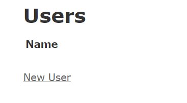

## 2.6 Railsバージョンアップ

Railsは新しいことにチャレンジするプロジェクトですので、バージョンアップの頻度も多いです。Rails公式のバージョンアップマニュアルもありますが、アプリケーションによってそれぞれ対応すべきことがあります。

通常必要となる流れは以下の通りです。

1. Rails 新バージョンにGemfileを更新
2. 設定ファイルの更新
3. テスト実行

今回は、「`Rails 7.1.1にGemfileを更新`」を行ってみましょう。

### 2.6.1 Rails 6.1.7.6 のGemを追加

まず現在のRailsのバージョンを意図的に古いバージョンとします。

以下のコマンドで使用できるRailsのバージョン一覧を確認しましょう。

```sh
$ gem list rails
```
実行後
```
rails (7.1.1)
```

この後にRails6をインストールしていきます。  
しかし、Rails7以前はNode.jsに依存していたため、Node.jsをインストールしないと動きません。  
以下のコマンドを実行してください。  
1. Node.jsをインストールするためにnodenvをインストール  
```sh
git clone https://github.com/nodenv/nodenv.git ~/.nodenv
git clone https://github.com/nodenv/node-build.git ~/.nodenv/plugins/node-build
echo 'export PATH="$HOME/.nodenv/bin:$PATH"' >> ~/.bashrc
echo 'eval "$(nodenv init -)"' >> ~/.bashrc
source ~/.bashrc
```

2. nodenvを使ってNode.jsをインストール  
```sh
nodenv install 16.14.0
```

3. インストールしたNode.jsを常用のnodeとして設定  
```sh
nodenv global 16.14.0
```

4. yarnをインストール  
```sh
curl -sS https://dl.yarnpkg.com/debian/pubkey.gpg | sudo apt-key add -
echo "deb https://dl.yarnpkg.com/debian/ stable main" | sudo tee /etc/apt/sources.list.d/yarn.list
sudo apt update
sudo apt install yarn -y
sudo apt remove nodejs -y
sudo ln -s `which node` /usr/bin/node
```
これで準備が整いました。  

該当バージョンに6.1.7.6が確認できない場合、以下のコマンドでRails 6.1.7.6 のバージョンをインストールします。
```sh
$ gem install -v 6.1.7.6 rails
```

インストール出来たら以下のコマンドで使用できるRailsのバージョン一覧を確認しましょう。
```sh
$ gem list rails
```

該当バージョンに6.1.7.6を確認することができました。
```
rails (7.1.1, 6.1.7.6)
```

これで古いバージョンでRailsアプリケーションを作成できるようになりました。

以下のコマンドでRails 6.1.7.6 のバージョンで新規プロジェクトを作成しましょう。
```sh
$ rails _6.1.7.6_ new ver_up_sample
```

作成後はディレクトリを移動しましょう。
```sh
$ cd ver_up_sample
```

移動後に以下も実行しておきましょう。
```sh
$ rails g scaffold User name
```
scaffold実行後
```sh
$ rails db:migrate
```

一通り完了したら、今回使用したRailsのバージョンでも画面が表示されることを確認しましょう。  
`rails s`でサーバを起動しましょう。  
起動しようとした際にエラーが発生し、サーバが起動しない場合には以下のコマンドを実行してください。

```sh
yarn add -D @babel/plugin-proposal-private-methods @babel/plugin-proposal-private-property-in-object
bin/rails webpacker:install
bin/rails webpacker:compile
```
Rails7以前はNode.jsに依存していたため、そのパッケージのバージョンによって依存関係が変わって、Railsで利用したいパッケージが不足している場合に起こります。以下のパッケージが不足しています。
```
@babel/plugin-proposal-private-methods
@babel/plugin-proposal-private-property-in-object
```

コマンドを入力出来たら再度サーバを起動して、<http://localhost:3000/users>にアクセスしてみましょう。  
  
このような画面が表示されていれば正しく起動できています。  


### 2.6.2 Rails 7.1.1にGemfileを更新
GemfileにあるRailsのバージョンアップを行います。現在のところRails6では 7.1.1が最新バージョンなのでGemfileを更新します。

```diff
・
・
・
# Bundle edge Rails instead: gem 'rails', github: 'rails/rails', branch: 'main'
-gem 'rails', '~> 6.1.7', '>= 6.1.7.6' # 削除
+gem 'rails', '7.1.1' # 追加
# Use sqlite3 as the database for Active Record
gem 'sqlite3', '~> 1.4'
# Use Puma as the app server
- gem 'puma', '~> 5.0' # 削除
+ gem "puma", ">= 5.0" # 追加
・
・
・
```

Gemのバージョン指定に`>=`を使うと、指定したバージョン以上の任意のバージョンが使用されます。  
今回は`puma`を5.0以上のバージョンで指定してみましょう。  
更新が終わったら`bundle update`を実行します。  
```
$ bundle update rails
```

依存するgemのバージョンが合わないエラーが起きなければ、`Bundle updated!`が最後に表示されるのでバージョンアップが完了です。
```
(省略)
Bundler attempted to update rails but its version stayed the same
Bundle updated!
```

それではもう一度画面を表示してみましょう。  
http://localhost:3000/users

ここで気を付けることとして、gemの更新後は`サーバーの再起動`を行いましょう。そうしないと更新した内容が反映されないからです。

適切にバージョンアップが完了していれば、画面も正しく表示されています。


<!-- 下記は必要？ -->
また、以下にREx[^1]を題材にバージョンアップ(Rails6環境内でのバージョンアップ)を行った場合の流れを
1. Rails 6.1.4.1にGemfileを更新
1. 設定ファイルの更新
1. テスト実行

まで載せています。


### 1 Rails 6.1.4.1にGemfileを更新(REx)

GemfileにあるRailsのバージョンアップを行います。

```diff
diff --git a/Gemfile b/Gemfile
index 7f53ce2..6c094b5 100644
--- a/Gemfile
+++ b/Gemfile
@@ -2,7 +2,7 @@ source 'https://rubygems.org'


 # Bundle edge Rails instead: gem 'rails', github: 'rails/rails'
-gem 'rails', '6.1.3.2'
+gem 'rails', '6.1.4.1'
 # Use sqlite3 as the database for Active Record
 gem 'sqlite3'
 # Use SCSS for stylesheets
```

更新が終わったら`bundle update rails`を実行します。アプリケーションにもよりますがRExでは依存するgemのバージョンが合わないエラーが起きました。ここからは地道な作業になります。エラーになったgemのバージョンを1つずつ適切なバージョンに上げていきます。適切なバージョンを調べるにはRubyGemsを使います。`coffee-rails`を例に作業を進めてみます。

```
Bundler could not find compatible versions for gem "railties":
  In Gemfile:
    coffee-rails (~> 4.1.0) was resolved to 4.1.1, which depends on
      railties (< 5.1.x, >= 4.0.0)
  （略）
```

`coffee-rails`のインストールで起きたエラーをじっくり読み進めてみましょう。`coffee-rails`はGemfileには`~> 4.1.0`とバージョン指定してインストールしています。`~>`は特殊なバージョン指定の仕方です。`~> 4.1.0`とすると`>= 4.1.0`かつ`< 4.2.0`という意味になります。`bundle update`を実行すると特定の範囲のなかでバージョンアップを行おうとします。この範囲だと`4.1.1`が最新ということになります。


`4.1.1`をインストールしようとすると依存するgemに`railties`があります。バージョンは`< 5.1.x`かつ`>= 4.0.0`になっている一方で、Rails 6.1.4.1ではrailtiesは`6.1.4.1`を期待しています。そのため、アップデート時にエラーになっています。


Rails 6.1.4.1にアップデートするのが主な目的なので`coffee-rails`のバージョンをrailtiesのバージョンに合うように修正します。今回は`coffee-rails`のバージョンを`4.2.2`に合わせるようにしました。

```diff
# Use Uglifier as compressor for JavaScript assets
gem 'uglifier', '>= 1.3.0'
# Use CoffeeScript for .coffee assets and views
-gem 'coffee-rails', '~> 4.1.0'
+gem 'coffee-rails', '~> 4.2.2'
# See https://github.com/rails/execjs#readme for more supported runtimes
gem 'therubyracer', platforms: :ruby
```

`coffee-rails`で手順を解説しましたが、他のgemに対しても同様の手順でバージョンアップしていきます。

`bundle update rails`を何度も実行して、`Bundle updated!`が表示されるまで根気よくやりましょう。

### 2 設定ファイルの更新(REx)

Railsは設定ファイルは`rails app:update`を実行してバージョンアップを行います。既存ファイルの内容や新規ファイルを作成してくれます。対話的に進めることが出来るので、内容の確認を行いながら進めていきます。長く運用されてきたプロジェクトでは設定ファイルひとつで動かなくなるケースもありますので、注意して進める必要があります。どのような修正をすべきなのかはアプリケーション毎にかなり異なりますのでここでは解説はしません。

```
$ bin/rails app:update
Running via Spring preloader in process 53099
Overwrite /Users/awesome-user/ruby/guppy0356/ruby-license/config/boot.rb?
(enter "h" for help) [Ynaqdh]
Overwrite /Users/awesome-user/ruby/guppy0356/ruby-license/config/routes.rb?
(enter "h" for help) [Ynaqdh]
Overwrite /Users/awesome-user/ruby/guppy0356/ruby-license/config/application.rb?
(enter "h" for help) [Ynaqdh]
Overwrite /Users/awesome-user/ruby/guppy0356/ruby-license/config/environment.rb?
(enter "h" for help) [Ynaqdh]
Overwrite /Users/awesome-user/ruby/guppy0356/ruby-license/config/secrets.yml?
(enter "h" for help) [Ynaqdh]
Overwrite /Users/awesome-user/ruby/guppy0356/ruby-license/config/environments/
development.rb? (enter "h" for help) [Ynaqdh]
Overwrite /Users/awesome-user/ruby/guppy0356/ruby-license/config/environments/
production.rb? (enter "h" for help) [Ynaqdh]
Overwrite /Users/awesome-user/ruby/guppy0356/ruby-license/config/environments/
test.rb? (enter "h" for help) [Ynaqdh]
Overwrite /Users/awesome-user/ruby/guppy0356/ruby-license/config/initializers/
assets.rb? (enter "h" for help) [Ynaqdh]

After this, check Rails upgrade guide at http://guides.rubyonrails.org/upgrading_ruby_on_rails.html for more details about upgrading your app.
```

もし、`rails app:update`で次のようなエラーが起きたら`config/application.rb`の内容を一部削除する必要があります。

```
/Users/awesome-user/.rvm/gems/ruby-2.7.4/gems/activerecord-6.1.3.2/lib/
active_record/dynamic_matchers.rb:22:in `method_missing': undefined method
`raise_in_transactional_callbacks=' for ActiveRecord::Base:Class (NoMethodError)
```

- config/application.rb
```
config.active_record.raise_in_transactional_callbacks = true # 削除
```

### 2 テスト実行(REx)

設定ファイルを修正できたら、アプリケーションが適切に動作しているかチェックする必要があります。RExではエンドツーエンドテストを自動化していますので簡単に設定に不備がないか等のバージョンアップに伴う障害を見つけることが出来ます。テストが無い場合はバージョンアップは危険ですので、控えたほうが良いと思います。

```
$ bin/rspec spec/acceptance/exam_history.feature

Randomized with seed 23893

Take Examination
  Take Ruby Programmer Silver
    Given build 100 ruby programmer silver examinations ->
    When I sign up for REx -> And I take silver examination ->
    And I get 76 score -> Then screen displays "今回の点数は、76点だよ！"


    （略）


Finished in 50.8 seconds (files took 9.39 seconds to load)
63 example, 0 failures

Randomized with seed 23893
```

失敗したテストはありませんでした。これで安心してバージョンアップしたアプリケーションをリリースすることが出来ます。

----
[^1]: REx https://rex.libertyfish.co.jp/
